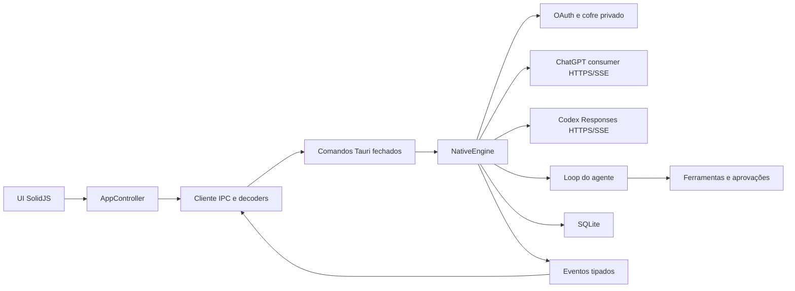

# Arquitetura

## Composição

Não existe processo intermediário, JSON-RPC genérico, seleção dinâmica de
backend ou dependência do Codex CLI. `EngineManager` possui exatamente uma
instância de `NativeEngine` durante a vida do aplicativo.

## Backend

`src-tauri/src/engine/contracts.rs` contém o domínio serializado. Os comandos em
`commands.rs` usam requests com `deny_unknown_fields`, validam tamanho e
semântica e chamam uma operação específica do engine.

O engine nativo divide ownership assim:

- `auth/`: fluxo OAuth, callback, tokens e envelope criptografado privado;
- `chat/`: catálogo consumer, Sentinel, prepare/conduit, deltas `v1` e stream de
  conversa do ChatGPT;
- `provider/`: catálogo Codex, Responses, cookies Cloudflare restritos com
  semântica completa de expiração/escopo e stream do agente;
- `agent.rs`: composição das instruções, rodadas e ciclo das ferramentas;
- `automation.rs`: agenda, limites e transições determinísticas das Automações;
- `tools/`: contratos e orquestração das ferramentas (`mod.rs`), operações de
  arquivo (`fs.rs`), resolução do `ripgrep` embarcado (`ripgrep.rs`), execução e
  árvore de processos (`exec.rs`) e confinamento de paths no workspace
  (`workspace.rs`);
- `approval.rs`: solicitações de uso único que aguardam decisão, cancelamento
  explícito ou encerramento, sem expiração arbitrária;
- `storage.rs`: schema SQLite próprio, transações e configuração versionada;
- `mod.rs`: ciclo de vida e ownership dos turnos em execução.

Um turno só se torna ativo após persistência e aquisição exclusiva do
`thread_id`. Falha ao publicar seus eventos iniciais executa rollback antes de a
operação retornar. Conclusão e interrupção removem o mesmo registro de ownership.
Excluir uma tarefa ativa registra a intenção nesse mesmo ownership, cancela o
turno e mantém a tarefa reservada até o storage finalizar e excluir os dados. A
interface nunca encadeia `interrupt` e `delete`, portanto não existe janela entre
as duas operações nem dependência do snapshot visual da tarefa.
No encerramento, novas operações são rejeitadas, aprovações são canceladas,
processos recebem cancelamento e as tasks possuem prazo de drenagem de dez
segundos.
Fechar a janela pelo `X` apenas a oculta quando existe algum turno ativo,
independentemente da preferência comum de bandeja. O comando explícito **Sair**
continua sendo a ação terminal e executa o encerramento normal.

Dev e release são perfis de runtime distintos. Release mantém o identificador
`dev.codexapp.desktop`; dev é iniciado com o override
`dev.codexapp.desktop.dev`. Cada perfil possui diretório Tauri, WebView e cofre
próprios, e o plugin de instância única impede dois processos do mesmo perfil.
O SQLite também grava um `owner_id` por processo e impõe, por índice parcial,
somente um turno `inProgress` por tarefa. A defesa no banco continua válida
mesmo se uma verificação de processo falhar.

## Frontend

O frontend possui quatro camadas:

1. `contracts/types.ts` define uniões discriminadas imutáveis;
2. `contracts/decode.ts` aceita `unknown` e rejeita campos, variantes, pares e
   relações semânticas inválidas;
3. `infrastructure/codexClient.ts` é a única camada que usa `invoke` e `listen`;
4. `state` e `ui` consomem somente valores já decodificados.

`appController.ts` define a fronteira pública imutável do controlador;
`createAppController.ts` possui a implementação e é o dono explícito do estado da
sessão. Cada tarefa ativa possui um runtime isolado em `threadRuntime.ts`; eventos
são roteados por `threadId`, e uma tarefa em segundo plano não altera a conversa
visível. Configurações usam uma fila serial explícita e modelo, esforço e tier são
gravados atomicamente. Login duplicado é coalescido e qualquer falha de contrato
entra nos diagnósticos e no alerta visível.
O composer mantém rascunhos efêmeros com ownership por `thread_id`; telas de
nova conversa usam uma chave separada por modo e workspace. Trocar de tarefa
salva e restaura somente o rascunho correspondente, incluindo anexos.

A inicialização possui uma revisão monotônica que impede tentativas antigas de
sobrescrever estado novo. Falhas transitórias de registro de eventos, timeout ou
comando nativo retryable são repetidas com backoff limitado; erros permanentes de
contrato e storage continuam explícitos. `engine_start` já entrega configuração,
eliminando uma segunda travessia IPC do caminho crítico.

Catálogos de modelos são lazy por produto, mantêm uma única requisição em voo e
reaproveitam o último valor válido no frontend e no Rust. Abertura de conversa
usa uma cache LRU de páginas com oito entradas. A página inicial contém até 64
itens de transcript e 4 MiB; páginas anteriores contêm até 256 itens e 4 MiB.
Fragmentos do mesmo turno na fronteira são reunidos por identidade, sem perder
ordem ou duplicar conteúdo. Conversas arquivadas só são consultadas quando a
página correspondente das configurações é realmente aberta.

Deltas de texto atravessam `streamDeltas.ts`: o primeiro fragmento de cada item
é aplicado imediatamente e os seguintes são coalescidos por frame. O runtime
armazena somente overlays do turno ativo; `item.completed` descarta deltas
pendentes, remove o item do overlay e torna o snapshot persistido imediatamente
autoritativo. O histórico persistido permanece uma única fonte de verdade.
`Markdown.tsx` usa modo append-only somente para IDs ainda presentes no overlay,
consolida blocos estáveis sem comparar novamente todo o prefixo acumulado e
sempre publica o valor terminal sem atraso. A timeline
projeta cada turno em blocos cronológicos: toda mensagem de usuário e agente
permanece na posição persistida, inclusive steers enviados durante um turno;
somente comandos, ferramentas, raciocínio e alterações entram nos blocos
recolhíveis de trabalho.

A ordem visual da timeline e a ordem causal do provider são domínios distintos.
Um steer é gravado imediatamente em `thread_items`, portanto aparece no instante
em que o usuário o enviou, mas seu payload do provider entra primeiro em
`pending_turn_inputs`. A promoção para `provider_items` ocorre
transacionalmente antes da próxima amostragem, depois da resposta e dos
resultados de ferramenta que estavam em andamento. Assim, uma rodada exigida por
steer termina causalmente em entrada de usuário, nunca em uma resposta anterior
do agente.

A timeline mantém uma janela explícita de turnos montados e expande o histórico
sob demanda sem alterar ordem, identificadores ou posição de leitura. Cada
componente é identificado pelo turno persistido e nunca é reciclado pela posição
relativa da janela para representar outro turno. Alturas medidas são
arredondadas, reunidas por frame e aplicam no máximo uma correção de âncora por
lote. Scroll, resize e sincronização de layout compartilham um único coordenador
por frame; intenção recente do usuário sempre prevalece sobre acompanhamento
automático do fim. Itens virtuais usam coordenadas inteiras de layout, sem
`translate3d`, e toda expansão participa da única viewport principal. Assim não
existe uma segunda área rolável disputando wheel, âncora ou altura.

Cada conversa possui uma sessão visual própria e limitada por LRU, contendo
posição de leitura, política de acompanhamento do fim e o índice de alturas já
medidas. A troca salva a sessão anterior, invalida frames e medições pendentes,
pré-calcula a janela com o índice correto e restaura a posição uma única vez no
frame seguinte. Retornar a uma conversa não reutiliza estimativas ou intenção de
scroll de outra tarefa. A sessão também conserva a identidade imutável da
projeção de turnos; quando ela não mudou, não recria chaves nem percorre os
1.000+ itens apenas para confirmar igualdade. A expulsão da cache remove somente
metadados visuais; turnos e conteúdo persistido nunca são limitados por ela.

`response.output_item.added` preserva a fase de mensagem antes do primeiro
delta. Por isso “Pensando” aparece imediatamente, acompanha o título da atividade
mais recente e desaparece quando a resposta final começa, sem montar cards vazios.
Disclosures de atividade, comando e diff nascem fechados e só montam o corpo
pesado quando abertos. Chaves de expansão são hierárquicas e isoladas pelo
identificador da conversa: sobrevivem à desmontagem temporária e à troca de
tarefa, mas fechar um pai remove todo o estado dos descendentes. Reabrir um grupo
começa com comandos e arquivos internos fechados, evitando remontagem pesada
involuntária. Mensagens de agente, inclusive commentary, são texto integral sem
card ou opção de recolher. A projeção de cada mensagem é total e não expõe
accessors condicionais que possam ficar obsoletos durante a desmontagem. Cada
turno possui uma fronteira de erro própria, permitindo continuar navegando o
restante da conversa; a fronteira global é o último isolamento do shell. Falhas
de renderização, Markdown, links, imagens e clipboard entram no mesmo canal
explícito de diagnóstico do controlador.

A revisão de alterações usa um `DiffDocument` imutável, analisado uma única vez
enquanto o conteúdo não muda. Estatísticas de cards fechados são calculadas sem
materializar linhas. O painel mantém uma lista de arquivos e um único documento
selecionado em uma viewport virtualizada: todas as linhas continuam navegáveis,
mas somente a interseção visível e o overscan entram no DOM. A altura lógica é
mapeada para um canvas físico limitado sem remover nenhuma posição da sequência.
Realce sintático é aplicado apenas às linhas adicionadas ou removidas que estão
visíveis; linhas patologicamente longas permanecem completas e escapadas, mas
sem decoração sintática.

O fluxo de produto possui duas camadas independentes: `ChatGPT | Codex` e,
dentro do ChatGPT, `Chat | Work`. A troca salva o destino atual antes de
restaurar a última conversa e o último projeto do destino escolhido. A lista do
ChatGPT reúne conversas Chat e Work; a lista do Codex contém apenas tarefas
Codex. Abrir uma conversa Chat ou Work também sincroniza o seletor interno.

Automações pertencem ao `NativeEngine`, não a timers da interface. Um scheduler
cancelável consulta dinamicamente o próximo vencimento, dorme no máximo quinze
minutos, acorda em mudanças e tenta novamente após quinze segundos em falhas
operacionais. O claim é transacional: no máximo duas execuções ficam
`queued/running` no aplicativo e somente uma por automação. Cada execução cria
uma tarefa Codex comum e percorre o mesmo pipeline de turno, ferramentas,
aprovações, persistência e eventos. Reinício converte execuções inacabadas em
`interrupted`; intervalos perdidos avançam a agenda uma vez, sem backfill em
rajada. A interface apresenta definições, editor, pausa, execução manual,
histórico e fila de revisão, mas não é proprietária da agenda.

## Dados e segredos

- SQLite: `native-state-profile-v2.sqlite3` no diretório de dados do perfil;
- sessão: `credentials-v2/chatgpt-oauth-v2.age` no mesmo domínio privado;
- identidade estável do cliente consumer: `chatgpt-consumer-device-id` no diretório
  de dados do aplicativo; contém somente um UUID aleatório, nunca tokens;
- chave do envelope: serviço `<identificador Tauri>.credentials-v2`, conta
  `chatgpt-oauth-v2`, no Windows Credential Manager;
- projetos conhecidos: schema local `codex-desktop.profile-v2.projects` no WebView;
- tarefas fixadas: schema local `codex-desktop.profile-v2.pinned-threads` no WebView.
- produto, modo e últimos destinos: schema local
  `codex-desktop.profile-v2.product-flow` no WebView.
- filas de mensagens por conversa: chaves versionadas sob
  `codex-desktop.profile-v2.message-queue.*` no WebView; não há teto local de
  quantidade e cada conversa é persistida independentemente antes de a mensagem
  ser aceita pela fila.
- preferência explícita de modelo/raciocínio do Chat:
  `codex-desktop.profile-v2.chat-intelligence` no WebView; a chave não existe enquanto o
  usuário usa o padrão dinâmico do catálogo.
- preferência de janela de contexto do Codex: mapa versionado dentro da
  configuração SQLite, indexado pelo ID do modelo; somente overrides `maximum`
  são persistidos e os valores numéricos são resolvidos do catálogo oficial da
  sessão.
- continuidade consumer do Chat: `conversation_id` e `parent_message_id` na
  tabela SQLite `chat_conversations`; tokens de integridade e conduit não são
  persistidos.
- Automações e execuções: tabelas SQLite `automations` e `automation_runs`, com
  versão otimista, agenda, vínculo opcional a projeto/tarefa/turno e estado de
  revisão. Até 500 execuções por automação são retidas; a leitura inicial da UI
  materializa no máximo 200.
- diagnósticos operacionais: `logs/runtime.jsonl` no diretório de dados do perfil,
  com rotação única para `logs/runtime.previous.jsonl`; o path absoluto atual é
  retornado por `engine_start` e exibido nas configurações.

Não há leitura de `CODEX_HOME`, `auth.json`, `global/CODEX_AUTH`, banco da CLI ou
outro formato externo anterior. O aplicativo não possui caminho de migração para
dados da CLI ou contratos externos; migrações internas do SQLite próprio seguem
os requisitos definidos em `docs/RULES.md`.

## Falhas e limites

Erros atravessam o IPC como `{ code, message, retryable }`. O provider limita
corpos HTTP e SSE e possui deadline de inatividade semântica. Falhas de
transporte, timeout, HTTP 5xx e `response.failed` transitórios são repetidas com
backoff limitado enquanto o turno continuar ativo; rate limits aguardam o reset
anunciado e voltam a consultar o serviço, sem teto local de tentativas. Alta
demanda possui código e apresentação de aviso próprios. Um estouro inesperado de
contexto recebe uma única compactação e repetição no turno ativo antes de se
tornar terminal. Erros de protocolo ou payload malformado falham explicitamente
para evitar loops infinitos de dados inválidos.
Leituras de arquivo e requisições possuem limites independentes; paths são
canonicalizados e symlinks não podem escapar do workspace. Estados desconhecidos
nunca viram fallback visual genérico.

Saída de processos é solicitada em modo sem cor; no Windows, o PowerShell recebe
configuração explícita de entrada, saída e comunicação nativa em UTF-8 sem BOM.
Antes da persistência, sequências ANSI/OSC, carriage return de progresso,
backspace e controles invisíveis são normalizados em streaming e não chegam ao
contrato visual. A migração transacional do schema SQLite 1 para o 2 normaliza
também saídas de comando antigas ao externalizá-las. A migração 2 para 3 cria
Automações e execuções de forma atômica. A migração 3 para 4 cria a fila
persistente de steers; um schema incompleto ou não versionado é rejeitado em vez
de ser reparado silenciosamente.

Saídas de ferramentas e comandos não ficam dentro de `thread_items`. O SQLite
mantém um recurso por item em `output_resources` e o texto integral em
`output_chunks`; o contrato do turno leva apenas uma prévia de 64 KiB, total de
bytes e cursor de continuação. Fork cria IDs e blocos independentes, e exclusão
usa as chaves estrangeiras para remover somente os recursos daquele thread.

O SQLite limita cada payload e cada página materializada, mas separa itens
visuais da timeline dos itens enviados ao provider. O limite do provider cobre o
pior caso Base64 aceito pela validação de anexos, portanto uma imagem válida não
pode ser aceita na entrada e rejeitada depois pelo storage. Saídas grandes
continuam fora dos itens e usam recursos paginados. O frontend limita
diagnósticos, projetos, anexos e o tamanho individual de cada mensagem
enfileirada; não impõe teto de quantidade às filas ou aprovações pendentes. A
capacidade do disco, a quota do armazenamento do WebView e os limites do provider
continuam externos ao aplicativo. Quando um limite de segurança é atingido, a
operação falha com motivo explícito.

Falhas operacionais do Rust e do frontend são gravadas como JSONL limitado e
também publicadas na interface. Exceções do frontend preservam a stack limitada
para diagnóstico. O log conserva timestamp, nível, subsistema e mensagem já
limitada; não grava tokens, cookies, requests ou respostas brutas.

O histórico do provider é normalizado antes da rede. Resultados abortados são
inseridos para chamadas interrompidas e resultados sem chamada são removidos;
a forma reparada substitui o histórico atomicamente e gera um diagnóstico
visível. Assim, uma interrupção ou encerramento no meio de um lote de ferramentas
não pode invalidar os turnos seguintes.

Durante um turno, o snapshot normalizado permanece em memória com o último
`sequence` de `provider_items` observado. Cada rodada promove primeiro os steers
pendentes, atualiza o snapshot apenas com as linhas novas e mantém os mesmos
limites globais de bytes e itens. O turno ativo registra separadamente o último
`sequence` de `pending_turn_inputs` aceito e o último já incluído numa
amostragem. Somente um steer posterior exige outra rodada; a continuação carrega
o watermark exato que deve ser promovido e falha explicitamente se essa promoção
não ocorrer.

Ferramentas pendentes continuam o loop sem criar entrada sintética. Normalização
e compactação substituem apenas o prefixo coberto pelo snapshot; steers ainda
pendentes ficam fora desse prefixo e são promovidos depois do checkpoint ou dos
resultados de ferramenta. Conclusão, interrupção e recuperação de inicialização
também promovem qualquer entrada restante antes de tornar o turno terminal,
preservando o texto do usuário após falha ou reinício.
