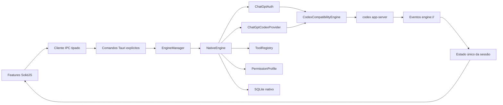

# Arquitetura

## Visão geral

O `EngineManager` é a fronteira de composição do aplicativo. A interface não
conhece processos, credenciais, SQLite ou JSON-RPC. O adaptador Codex também não
conhece componentes visuais.

O desenho separa duas coisas que hoje ainda coexistem:

1. responsabilidades nativas que pertencem ao projeto;
2. transporte oficial temporário necessário para login e execução ChatGPT.

Essa divisão torna a substituição incremental e testável. Nenhum componente da UI
precisa mudar quando o provider deixar de usar a ponte.

## Backend Rust

### Contrato do engine

`src-tauri/src/engine/contracts.rs` define operações de domínio fechadas, como
`StartThread`, `StartTurn`, `LoginChatGpt` e `BatchWriteConfig`. A UI não
consegue enviar um método RPC arbitrário.

`AgentEngine` define somente quatro capacidades de ciclo de vida:

- iniciar;
- executar uma operação tipada;
- responder a uma solicitação pendente;
- encerrar.

`EngineManager` seleciona uma implementação uma única vez na inicialização. O
modo padrão é `NativeEngine`; `CODEX_APP_ENGINE=compatibility` existe apenas
para diagnóstico da fronteira antiga.

### NativeEngine

`src-tauri/src/engine/native` é organizado por ownership:

- `auth.rs`: autenticação ChatGPT e limite de credenciais;
- `provider.rs`: execução e catálogo oferecidos pelo provider;
- `tools.rs`: registro explícito das ferramentas e seu nível de risco;
- `sandbox.rs`: políticas e presets semânticos de permissão;
- `storage.rs`: metadados locais versionados em SQLite;
- `mod.rs`: composição, roteamento e ciclo de vida.

O banco `native-engine.sqlite3` registra somente identificadores, workspace,
nome da operação e timestamps. Prompts, respostas, anexos e tokens não são
persistidos nessa camada.

### Ponte de compatibilidade

`src-tauri/src/engine/compatibility.rs` converte operações do engine para o
contrato oficial. `src-tauri/src/codex/runtime.rs` é o único dono do processo
filho: resolve o binário, inicia `codex app-server --listen stdio://`, executa
o handshake, serializa JSONL e correlaciona respostas por identificador.

O processo usa I/O assíncrono, timeout limitado, encerramento no ciclo de vida do
app e uma única trava de inicialização. O executável auxiliar não abre console no
Windows.

### Ponte Tauri

`src-tauri/src/commands.rs` contém comandos pequenos e nomeados. Cada comando:

1. recebe uma estrutura tipada;
2. valida dados pertencentes ao aplicativo;
3. cria uma `EngineOperation`;
4. delega ao `EngineManager`;
5. devolve um erro serializável.

A conversão para o protocolo Codex acontece apenas dentro do adaptador de
compatibilidade.

## Frontend

`src/features` é organizado por capacidade:

- `auth`: entrada e saída da conta;
- `chat`: timeline, compositor, anexos e seleção de modelo;
- `approvals`: decisões explícitas para solicitações do agente;
- `settings`: preferências, conta, engine e configuração avançada;
- `session`: dono único do estado e tradutor de eventos;
- `shell`: navegação, painel de ambiente e composição visual.

`src/shared/codex` contém os contratos atualmente retornados pelo provider
Codex, helpers de modelos e o cliente IPC. Componentes sem regra de negócio ficam
em `src/shared/components`. Quando um provider nativo substituir um contrato
Codex, o tipo correspondente deve migrar para um contrato de domínio neutro.

## Fluxos principais

### Inicialização

1. A UI assina os eventos `engine://*` e invoca `engine_start`.
2. O `NativeEngine` valida ferramentas e inicializa o SQLite.
3. A ponte executa `initialize` e `initialized`.
4. A resposta inclui descritor do engine, provider, transporte e capacidades.
5. Conta, configuração e modelos são carregados em paralelo.

### Login pelo ChatGPT

`ChatGptAuth` aceita somente operações de conta. O adaptador envia
`account/login/start` com `type: "chatgpt"`; o navegador conclui o fluxo
oficial e a ponte administra persistência e renovação. A UI recebe a URL e os
eventos de conclusão, nunca tokens.

Não existe fallback automático para chave de API. Se a ponte estiver ausente ou
incompatível, o erro é exibido e o app não tenta outro mecanismo silenciosamente.

### Mensagem e anexos

Arquivos comuns viram entradas `mention`; imagens validadas viram
`localImage`; texto vira `text`. Imagens coladas são decodificadas no Rust,
validadas por assinatura e gravadas no cache do aplicativo antes do envio.

### Aprovações

Solicitações com método e identificador chegam pelo evento
`engine://server-request`. A UI mostra uma decisão explícita e responde com o
mesmo identificador. Métodos não suportados nunca recebem aprovação automática.

### Configuração e permissões

Leitura e escrita usam operações de domínio dedicadas. A ponte atual as traduz
para `config/read`, `config/value/write` e `config/batchWrite`.

Os presets são semânticos:

- **Somente leitura**: `read-only` + `untrusted`;
- **Aprovar por mim**: `workspace-write` + `on-request`;
- **Acesso completo**: `danger-full-access` + `never`;
- qualquer outra combinação: **Personalizado**.

Cada preset é aplicado por uma única escrita em lote para não criar um estado
intermediário incoerente.

## Sistema visual

Shell, compositor, menus em cascata e configurações são componentes
independentes. A paleta observada na referência é expressa por tokens CSS. Não há
código que altere DPI, zoom do WebView ou escala do Windows.

## Regra de evolução

Uma capacidade nova deve seguir esta ordem:

1. contrato de domínio em `engine/contracts.rs`;
2. implementação nativa ou adaptador explicitamente isolado;
3. comando Tauri nomeado quando iniciado pela UI;
4. transição no dono de estado em `features/session`;
5. feature visual independente;
6. teste focado na fronteira e validação ao vivo.

Não se cria RPC genérico, armazenamento paralelo de credenciais ou fallback
silencioso. Modularidade aqui significa ownership claro e dependências em uma
direção.
