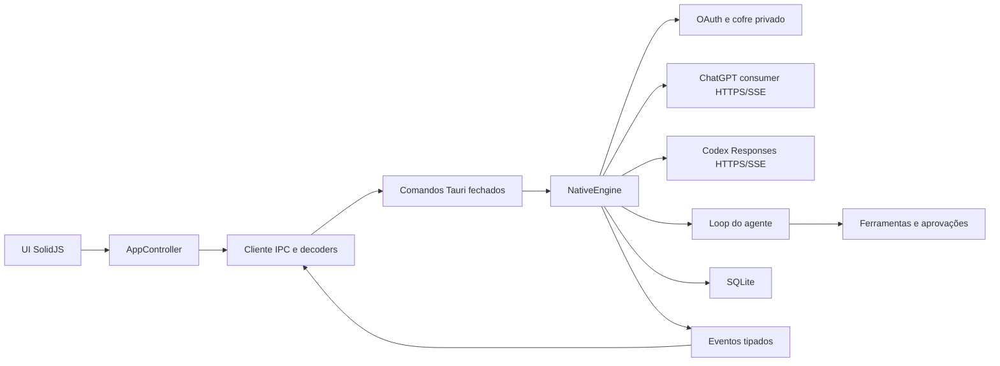
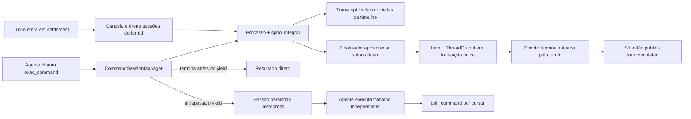

# Arquitetura

## Composição

Não existe processo intermediário, JSON-RPC genérico, seleção dinâmica de
backend ou dependência do Codex CLI. `EngineManager` possui exatamente uma
instância de `NativeEngine` durante a vida do aplicativo.

## Backend

`src-tauri/src/engine/contracts.rs` contém o domínio serializado. Os comandos em
`commands.rs` usam requests com `deny_unknown_fields`, validam tamanho e
semântica e chamam uma operação específica do engine.

O engine nativo divide ownership assim:

- `auth/`: fluxo OAuth, callback, tokens e envelope criptografado privado;
- `chat/`: catálogo consumer, Sentinel, prepare/conduit, deltas `v1` e stream de
  conversa do ChatGPT;
- `provider/`: catálogo Codex, Responses, cookies Cloudflare restritos com
  semântica completa de expiração/escopo e stream do agente;
- `agent.rs`: composição das instruções, rodadas e ciclo das ferramentas;
- `automation.rs`: agenda, limites e transições determinísticas das Automações;
- `tools/`: contratos e orquestração das ferramentas (`mod.rs`), operações de
  arquivo (`fs.rs`), resolução do `ripgrep` embarcado (`ripgrep.rs`), execução e
  árvore de processos (`exec.rs`), transcript incremental
  (`command_output_stream.rs`), sessões longas e polling
  (`command_sessions.rs`) e confinamento de paths no workspace (`workspace.rs`);
- `approval.rs`: solicitações que aguardam decisão ou cancelamento explícito;
  comandos podem receber autorização limitada à tarefa durante a sessão atual;
- `storage.rs`: schema SQLite próprio, transações e configuração versionada;
- `mod.rs`: ciclo de vida e ownership dos turnos em execução.

`src-tauri/src/browser.rs` permanece fora do engine porque administra uma
superfície desktop, não contexto do provider. `BrowserManager` possui os child
webviews nativos, histórico, carregamento, título, visibilidade e bounds. Cada
aba pertence a uma conversa e nenhum webview remoto recebe as capabilities IPC
do webview local `main`. Comandos que manipulam webviews são assíncronos para
não bloquear o dispatcher da janela; callbacks WebView2 apenas atualizam estado
e enfileiram a emissão depois de retornar, evitando reentrância no IPC.

O Browser Use mantém essa separação, mas o loop nativo do agente acessa a mesma
instância registrada de `BrowserManager` pelo `AppHandle`. A composição é
modular:

- `browser/agent.rs`: locks assíncronos por conversa, aba ativa, topologia,
  espera de carregamento, política de origem e ciclo do painel;
- `browser/automation.rs`: única região que nomeia WebView2/COM; scripts com
  retorno, métodos CDP fechados, snapshot renderizado, screenshot JPEG limitado
  e entrada confiável de mouse/teclado;
- `browser/metrics.rs`: eventos tipados, janela recente e JSONL rotativo;
- `engine/native/tools/browser.rs`: sete ferramentas fechadas, validação dos
  argumentos, aprovação cancelável e projeção para provider/timeline.

O modelo nunca recebe um endpoint CDP genérico. Referências de elemento são
produzidas pelo snapshot, pertencem ao documento atual e ficam obsoletas após
mudanças de página. A inicialização injetada em cada documento mantém o cursor
visual do agente e coletores limitados de erro, falha de recurso, CLS, LCP e
long tasks. Cliques que tentam atravessar uma origem não aprovada são bloqueados
no callback síncrono, convertidos em uma transição pendente e retomados somente
depois da decisão explícita.

O loop recompõe um protocolo de execução curto junto das instruções cacheadas do
modelo. Ele define autonomia para mudanças locais autorizadas, commentary apenas
com resultado concreto e próximo passo, atualização antes/depois de esperas
longas, plano para trabalho realmente multifásico, paralelismo somente entre
operações independentes e promoção rápida de comandos previsivelmente longos.
O `prompt_cache_key` continua sendo o identificador da tarefa, portanto esse
prefixo estável não vira contexto novo a cada poll.

Cada ação visual devolve texto e screenshot no mesmo
`function_call_output.output` multimodal. Storage grava essa saída e o item da
timeline na mesma transação; o modelo nunca inicia a rodada seguinte com uma
captura ausente ou fora de ordem.

Comandos longos permanecem no domínio do engine:

A sessão devolvida ao agente possui uma licença exclusiva: commit confirma que
o item inicial já foi persistido e publicado; abandono da licença descarta e
cancela a sessão. A sessão é um recurso estritamente pertencente ao turno: antes
de qualquer settlement terminal, o manager cancela as árvores ainda ativas,
drena seus dois pipes, persiste os itens terminais e remove todas as sessões
daquele `turnId`. O evento `turn.completed` é publicado somente depois dessa
barreira. Deltas carregam `turnId`, portanto nenhuma atualização pode migrar para
outro turno durante a execução.

Um turno só se torna ativo após persistência e aquisição exclusiva do
`thread_id`. Falha ao publicar seus eventos iniciais executa rollback antes de a
operação retornar. Conclusão e interrupção removem o mesmo registro de ownership.
Excluir uma tarefa ativa registra a intenção nesse mesmo ownership, cancela o
turno e mantém a tarefa reservada até o storage finalizar e excluir os dados. A
interface nunca encadeia `interrupt` e `delete`, portanto não existe janela entre
as duas operações nem dependência do snapshot visual da tarefa.
No encerramento, novas operações são rejeitadas, aprovações são canceladas,
processos recebem cancelamento e as tasks possuem prazo de drenagem de dez
segundos.
Fechar a janela pelo `X` apenas a oculta quando existe algum turno ativo,
independentemente da preferência comum de bandeja. O comando explícito **Sair**
continua sendo a ação terminal e executa o encerramento normal.

Dev e release são perfis de runtime distintos. Release mantém o identificador
`dev.codexapp.desktop`; dev é iniciado com o override
`dev.codexapp.desktop.dev`. Cada perfil possui diretório Tauri, WebView e cofre
próprios, e o plugin de instância única impede dois processos do mesmo perfil.
O SQLite também grava um `owner_id` por processo e impõe, por índice parcial,
somente um turno `inProgress` por tarefa. A defesa no banco continua válida
mesmo se uma verificação de processo falhar.

## Frontend

O frontend possui quatro camadas:

1. `contracts/types.ts` define uniões discriminadas imutáveis;
2. `contracts/decode.ts` aceita `unknown` e rejeita campos, variantes, pares e
   relações semânticas inválidas;
3. `infrastructure/codexClient.ts` é a única camada que usa `invoke` e `listen`;
4. `state` e `ui` consomem somente valores já decodificados.

`appController.ts` define a fronteira pública imutável do controlador;
`createAppController.ts` possui a implementação e é o dono explícito do estado da
sessão. Cada tarefa ativa possui um runtime isolado em `threadRuntime.ts`; eventos
são roteados por `threadId`, e uma tarefa em segundo plano não altera a conversa
visível. Configurações usam uma fila serial explícita e modelo, esforço e tier são
gravados atomicamente. Login duplicado é coalescido e qualquer falha de contrato
entra nos diagnósticos e no alerta visível.
O composer mantém rascunhos efêmeros com ownership por `thread_id`; telas de
nova conversa usam uma chave separada por modo e workspace. Trocar de tarefa
salva e restaura somente o rascunho correspondente, incluindo anexos.

`LatestTurnFileChangeStore` projeta os `FileChange` do turno ativo ou do último
turno concluído. O gatilho de revisão existe sempre que essa projeção possui
arquivos, independentemente de o agente ter publicado um plano ou de o turno já
ter terminado. `AppShell` mantém timeline e composer no caminho inicial e
carrega Configurações, Automações, Browser e Revisão por `import()` somente
quando a superfície correspondente é aberta.

O navegador interno também possui estado isolado por conversa. O controller
frontend restaura abas lazy a partir de um schema local fechado, adota o webview
nativo existente de forma idempotente e coalesce sincronizações de bounds pela
assinatura conversa/aba/retângulo. O painel implementa abas, endereço,
voltar/avançar, recarregar e abertura externa sem iframe; fechar ou ocultar a
superfície esconde o child webview no mesmo ciclo de vida.

Eventos `browser://agent-activity` substituem a topologia da conversa de forma
autoritativa e abrem/fecham o painel somente quando a tarefa correspondente está
visível. Eventos `browser://metric` alimentam o painel de diagnóstico sem
polling. Se a ação mais recente falhar antes de capturar a página, a UI mantém
os achados da última amostra válida e mostra a falha separadamente.

A inicialização possui uma revisão monotônica que impede tentativas antigas de
sobrescrever estado novo. Falhas transitórias de registro de eventos, timeout ou
comando nativo retryable são repetidas com backoff limitado; erros permanentes de
contrato e storage continuam explícitos. `engine_start` já entrega configuração,
eliminando uma segunda travessia IPC do caminho crítico.

O preview de desenvolvimento usa `infrastructure/runtimeBridge.ts` em vez de
reescrever `window.__TAURI_INTERNALS__`. A mesma infraestrutura frontend chama o
runtime Tauri em produção e um backend determinístico em memória no navegador.
Isso mantém o app totalmente interativo em navegadores anexados que protegem os
internals próprios e evita transformar a validação visual em capturas estáticas.

Catálogos de modelos são lazy por produto, mantêm uma única requisição em voo e
reaproveitam o último valor válido no frontend e no Rust. Abertura de conversa
usa uma cache LRU de páginas com oito entradas. A página inicial contém até 64
itens de transcript e 4 MiB; páginas anteriores contêm até 256 itens e 4 MiB.
Fragmentos do mesmo turno na fronteira são reunidos por identidade, sem perder
ordem ou duplicar conteúdo. Conversas arquivadas só são consultadas quando a
página correspondente das configurações é realmente aberta.

`ProfileView.tsx` renderiza o conteúdo de Perfil dentro de
`Configurações > Perfil`. O controller possui separadamente identidade
carregada, estado de leitura e erro; o coordenador de perfil coalesce requisições
e invalida por revisão/identidade da sessão. `profileActivity.ts` é uma projeção
pura de 52 semanas que produz células, níveis, totais semanais, acumulados e
rótulos mensais sem chamadas de rede ou acesso ao DOM. O componente apenas
renderiza esse contrato e mantém a agregação selecionada localmente.

Deltas de texto e de comando atravessam `streamDeltas.ts`: o primeiro fragmento
de cada alvo é aplicado imediatamente e os seguintes são coalescidos por frame.
Saída de comando usa operações tipadas por stream (`append`, `backspace`,
`clearCurrentLine` e `truncated`), frames de no máximo 8 KiB e uma prévia
transitória combinada de 256 KiB. O backend faz flush de todos os deltas antes de
publicar qualquer item terminal. Um comando que apenas ultrapassou o yield
continua usando semântica `item.started`, preserva o overlay e aceita novos
deltas; somente o estado terminal usa `item.completed`, descarta o overlay e
torna o snapshot persistido autoritativo. Polls internos são itens causais do
provider, mas não unidades visuais da timeline. A prévia ao vivo nunca entra no
histórico nem no contexto do provider.
`Markdown.tsx` usa modo append-only somente para IDs ainda presentes no overlay,
consolida blocos estáveis sem comparar novamente todo o prefixo acumulado e
sempre publica o valor terminal sem atraso. A timeline
projeta cada turno em blocos cronológicos: toda mensagem de usuário e agente
permanece na posição persistida, inclusive steers enviados durante um turno;
somente comandos, ferramentas, raciocínio e alterações entram nos blocos
recolhíveis de trabalho.

Blocos de código Markdown, diffs e leituras de arquivo compartilham o motor próprio em
`ui/syntax/`. O registro fechado resolve dezenove linguagens sem autodetecção
probabilística; o tokenizer preserva estado de comentários e strings multilinha,
produz tokens tipados e nunca retorna HTML arbitrário. Markdown serializa esses
tokens com escaping antes do sanitizador e usa o worker já existente somente
acima de 32 KiB. Diffs aceitam o preview nativo completo de até 128 KiB e 4.096
linhas; `read_file` recebe `sourceFile { path }` no contrato e conserva estado
multiline, enquanto `search_text` colore cada trecho pela extensão do path do
resultado. Listagens e saídas arbitrárias permanecem explicitamente tipadas como
não-código. Nenhum renderer infere linguagem pelo conteúdo.

Um `fileChange` com exatamente um arquivo não cria um segundo agrupador: o bloco
do próprio arquivo é a superfície principal, inicia recolhido e mantém o mesmo
ícone de edição usado nas listas. Uma coleção autônoma com duas ou mais
alterações mantém um disclosure agregado; quando já está dentro de um grupo de
atividades, os arquivos aparecem diretamente, sem cabeçalho intermediário de
contagem. Os gutters usam a quantidade real de dígitos, e metadados
`No newline at end of file` permanecem no diff canônico sem ocupar uma linha
visual. Cada alteração carrega `lineStats` autoritativo calculado antes de
truncar o preview; históricos internos anteriores ao campo derivam a estatística
do diff persistido.

Resultados `view_image` usam a apresentação contratual `image`. O frontend
aceita somente o envelope fechado `{ image_url }`, MIME de imagem seguro em data
URL ou HTTP(S) sem credenciais, e nunca imprime o payload bruto. Chamadas
consecutivas são projetadas como uma unidade “Visualizou N imagens”, preservando
uma miniatura por chamada e a identidade do primeiro item, como no fluxo oficial.

A ordem visual da timeline e a ordem causal do provider são domínios distintos.
Um steer é gravado imediatamente em `thread_items`, portanto aparece no instante
em que o usuário o enviou, mas seu payload do provider entra primeiro em
`pending_turn_inputs`. A promoção para `provider_items` ocorre
transacionalmente antes da próxima amostragem, depois da resposta e dos
resultados de ferramenta que estavam em andamento. Assim, uma rodada exigida por
steer termina causalmente em entrada de usuário, nunca em uma resposta anterior
do agente.

A timeline mantém uma janela explícita de turnos montados e expande o histórico
sob demanda sem alterar ordem, identificadores ou posição de leitura. Cada
componente é identificado pelo turno persistido e nunca é reciclado pela posição
relativa da janela para representar outro turno. Alturas medidas são
arredondadas e reunidas em uma microtask por ciclo de layout. Antes de qualquer
mutação do índice, a timeline captura a identidade do turno, o ponto interno da
leitura e sua posição no viewport; depois atualiza a janela virtual e aplica no
máximo uma compensação no frame seguinte, antes da pintura. Essa compensação
preserva o conteúdo sob o olhar sem desfazer o delta mais recente de wheel,
teclado, touch ou drag. Navegações instantâneas e suaves possuem proveniência
explícita e são consumidas pelo destino real ou por `scrollend`; não existe janela
temporal que confunda uma correção de layout com intenção do usuário. Disclosures
publicam uma revisão explícita de layout e medem imediatamente os turnos
montados. O navegador lateral resolve a âncora DOM pelo `message.id`, não apenas
o início do turno; isso distingue steers do mesmo turno e mantém a intenção até a
geometria ficar estável. Para mensagens fora da janela, o offset do turno serve
somente para montá-las e a âncora real faz o alinhamento final. Scroll, resize,
medição e sincronização compartilham um único coordenador por frame, que reúne
leituras antes das escritas para não forçar layout no caminho quente. Itens
geométricos estáveis (`clientHeight`, `scrollHeight`, offset da lista e altura da
pista) formam um snapshot renovado somente quando o layout muda; frames de
scroll ordinário atualizam a posição contra esse snapshot, sem consultar layout
depois da reciclagem reativa. Itens
virtuais usam coordenadas inteiras de layout, sem `translate3d`, e toda expansão
participa da mesma política de viewport. Regiões de código limitadas, como
comando, leitura e diff, declaram explicitamente
`data-timeline-scroll-region`; não existe descoberta heurística com
`getComputedStyle` durante wheel. Enquanto houver faixa interna elas consomem o
movimento. Ao alcançar um limite, somente o excedente exato é transferido para a
timeline no mesmo evento. Um wheel totalmente interno não altera a política de
acompanhamento da conversa. O eixo vertical mantém chaining nativo para touch e
o eixo horizontal do diff permanece contido.

Grupos de trabalho longos possuem uma segunda janela virtual por atividade. A
virtualização entra quando há mais de 48 unidades ou mais de quatro disclosures
descendentes abertos; grupos pequenos continuam integralmente semânticos para
busca e acessibilidade. Alturas ficam em uma LRU por grupo/conversa e são
invalidadas pela mesma assinatura de layout da timeline. A projeção da lista é
segmentada pelos itens de protocolo: construir uma atividade com 100 mil arquivos
percorre apenas os lotes superiores e não cria 100 mil view-models, strings de
identidade ou entradas de `Map`. `count`, geometria prefixada e busca binária ficam
disponíveis imediatamente; chave e entrada são derivadas somente para a janela
visível e mantidas em uma cache associativa fixa de 256 posições. Identidades
repetidas continuam exatas pela combinação item, caminho e ocorrência, sem hash
probabilístico.

O virtualizador aceita essa fonte indexada diretamente. Uma estimativa uniforme
usa Fenwick em `O(log n)`; uma base segmentada combina busca binária com deltas
esparsos medidos. Coleções de até 4.096 entradas materializam o pequeno índice para
recalcular todas as alturas não uniformes; acima disso, apenas as exceções
visitadas são armazenadas. O limiar escolhe a representação, não limita nem
descarta conteúdo. Quando todos os arquivos chegam ao mesmo estado, a base muda
transacionalmente entre 26 e 398 px e elimina os overrides. O estado dos
disclosures usa uma trie hierárquica com contagem agregada; fechar um grupo inteiro
descarta a subárvore em `O(profundidade)`, sem percorrer seus descendentes.

Durante movimento rápido o overscan cai para zero; após 90 ms de repouso volta a
dois itens por lado. Todo item que intersecta o viewport monta sempre o conteúdo
real: somente corpos do overscan, ainda fora da área visível, podem ser adiados.
Geometria física e cardinalidade da faixa são sinais separados; mover alguns
pixels sem cruzar uma fronteira preserva a mesma faixa por referência e não
recalcula chaves, slots ou corpos. A janela comum, limitada a 64 slots, usa scans
diretos sem `Map`, `Set` ou filas transitórias; a rota geral mantém índices e
filas lineares. Ambas conservam o mesmo resumo quando ele continua visível e uma
única observação de tamanho enquanto o slot é reciclado. Faixas disjuntas de uma
categoria uniforme reutilizam o pool na mesma ordem.
Disclosures controlados guardam a chave atual em um registro fraco associado ao
resumo; o DOM recebe apenas um marcador estável e o listener delegado não regrava
chaves hierárquicas longas a cada scroll.

Medições válidas são reunidas em uma microtask e versionadas por conteúdo e
layout. A âncora visual registra também o `scrollTop` da captura: a compensação só
é aplicada se o usuário não moveu a viewport nesse intervalo. Uma âncora antiga
nunca une faixas virtuais disjuntas. Assim, expansão legítima continua com drift
zero, enquanto wheel rápido não produz skeleton, quadro vazio, remount completo,
salto concorrente ou faixa temporariamente gigantesca.

Leituras e diffs expandidos possuem uma janela adicional de linhas com geometria
fixa e canvas físico limitado. A projeção pesada é aquecida quando o disclosure
abre; janelas semânticas `rowgroup`/`row` são cacheadas por documento e
reutilizadas por um pool limitado. A grade usa papéis ARIA explícitos e blocos
com posicionamento previsível, sem depender do modelo de formatação nativo de
tabelas para virtualizar linhas. Trocar a faixa visível substitui uma seção
pronta, sem montar milhares de componentes, observar novamente a viewport
interna ou repetir linhas já tokenizadas. Cada viewport interno mantém sua última
posição a partir do evento de scroll; trocar a identidade com a posição já
zerada não lê `scrollTop` depois da mutação do DOM e, portanto, não força layout
síncrono no frame da timeline. Em superfícies de altura intrínseca o próprio diff
declara seu limite; em painéis, o contêiner é o único dono da altura e o
`ResizeObserver` apenas informa esse espaço ao virtualizador. O viewport efetivo
também desconta a área ocupada pelo composer uma única vez, portanto nenhuma
linha é considerada visível atrás do dock.

O syntax highlighter de diff valida os limites do hunk uma vez, mas tokeniza
somente até a última linha solicitada. O tokenizer e as linhas já produzidas
permanecem associados ao documento, preservando estado léxico multilinha e
continuando exatamente do ponto anterior quando o viewport interno avança.

Cada conversa possui uma sessão visual própria e limitada por LRU, contendo
posição numérica, âncora identificável, política de acompanhamento do fim e o
índice de alturas já medidas. A troca salva a sessão anterior, invalida frames e
medições pendentes, pré-calcula a janela pelo turno ancorado e restaura a posição
uma única vez no frame seguinte. A assinatura de medição inclui largura, tamanho
de fonte e modo de diff; qualquer mudança invalida alturas dependentes do layout
sem perder a identidade da leitura. O prepend de histórico usa a posição atual
no instante em que a sequência muda, não o `scrollTop` anterior ao I/O, e também
considera mudanças no conteúdo que antecede a lista. Retornar a uma conversa não
reutiliza estimativas ou intenção de scroll de outra tarefa. A sessão conserva a
identidade imutável da projeção de turnos; quando ela não mudou, não recria
chaves nem percorre os 1.000+ itens apenas para confirmar igualdade. A expulsão
da cache remove somente metadados visuais; turnos e conteúdo persistido nunca
são limitados por ela.

`response.output_item.added` preserva a fase de mensagem antes do primeiro
delta. Por isso “Pensando” aparece imediatamente, acompanha o título da atividade
mais recente e desaparece quando a resposta final começa, sem montar cards
vazios. Na variante visual de 21 de agosto, a atividade ativa mantém uma cópia
semântica e uma camada decorativa `aria-hidden`. A faixa cruza o texto em 48
degraus durante o primeiro quarto de um ciclo de 2 s, após atraso inicial de
600 ms, e permanece em pausa por aproximadamente 1,5 s até a repetição. O
texto-base usa o mesmo cinza e peso das atividades concluídas; somente a faixa
usa a cor primária, ampliando o contraste do brilho sem adicionar outra animação.
Disclosures de atividade, comando e diff nascem fechados e só montam o corpo
pesado quando abertos. Chaves de expansão são hierárquicas e isoladas pelo
identificador da conversa: sobrevivem à desmontagem temporária e à troca de
tarefa, mas fechar um pai remove todo o estado dos descendentes. Reabrir um grupo
começa com comandos e arquivos internos fechados, evitando remontagem pesada
involuntária. Mensagens de agente, inclusive commentary, são texto integral sem
card ou opção de recolher. A projeção de cada mensagem é total e não expõe
accessors condicionais que possam ficar obsoletos durante a desmontagem. Cada
turno possui uma fronteira de erro própria, permitindo continuar navegando o
restante da conversa; a fronteira global é o último isolamento do shell. Falhas
de renderização, Markdown, links, imagens e clipboard entram no mesmo canal
explícito de diagnóstico do controlador.

A revisão de alterações usa um `DiffDocument` imutável, analisado uma única vez
enquanto o conteúdo não muda. Estatísticas de cards fechados são calculadas sem
materializar linhas. O painel mantém uma lista de arquivos e um único documento
selecionado em uma viewport virtualizada: todas as linhas continuam navegáveis,
mas somente a interseção visível e o overscan entram no DOM. A altura lógica é
mapeada para um canvas físico limitado sem remover nenhuma posição da sequência.
Cada hunk pequeno é tokenizado como um bloco único para preservar estado entre
linhas adicionadas, removidas e de contexto. O cache LRU pertence ao `DiffView`,
é limitado por entradas e bytes estimados e não sobrevive à troca de documento
ou path. Hunks acima de 256 linhas, 32 KiB, ou com uma linha acima de 4 KiB
abandonam a captura durante o parse e usam texto puro. Assim, um diff de 150 mil
linhas não conserva uma segunda cópia do conteúdo nem inicia trabalho sintático
que nunca será exibido.

O fluxo de produto possui duas camadas independentes: `ChatGPT | Codex` e,
dentro do ChatGPT, `Chat | Work`. A troca salva o destino atual antes de
restaurar a última conversa e o último projeto do destino escolhido. A lista do
ChatGPT reúne conversas Chat e Work; a lista do Codex contém apenas tarefas
Codex. Abrir uma conversa Chat ou Work também sincroniza o seletor interno.

Automações pertencem ao `NativeEngine`, não a timers da interface. Um scheduler
cancelável consulta dinamicamente o próximo vencimento, dorme no máximo quinze
minutos, acorda em mudanças e tenta novamente após quinze segundos em falhas
operacionais. O claim é transacional: no máximo duas execuções ficam
`queued/running` no aplicativo e somente uma por automação. Cada execução cria
uma tarefa Codex comum e percorre o mesmo pipeline de turno, ferramentas,
aprovações, persistência e eventos. Reinício converte execuções inacabadas em
`interrupted`; intervalos perdidos avançam a agenda uma vez, sem backfill em
rajada. A interface apresenta definições, editor, pausa, execução manual,
histórico e fila de revisão, mas não é proprietária da agenda.

## Dados e segredos

- SQLite: `native-state-profile-v2.sqlite3` no diretório de dados do perfil;
- sessão: `credentials-v2/chatgpt-oauth-v2.age` no mesmo domínio privado;
- identidade estável do cliente consumer: `chatgpt-consumer-device-id` no diretório
  de dados do aplicativo; contém somente um UUID aleatório, nunca tokens;
- chave do envelope: serviço `<identificador Tauri>.credentials-v2`, conta
  `chatgpt-oauth-v2`, no Windows Credential Manager;
- projetos conhecidos: schema local `codex-desktop.profile-v2.projects` no WebView;
- tarefas fixadas: schema local `codex-desktop.profile-v2.pinned-threads` no WebView.
- projetos fixados: schema local `codex-desktop.profile-v2.pinned-projects` no
  WebView.
- estado do sidebar por projeto: schema local
  `codex-desktop.profile-v2.project-sidebar` no WebView.
- abas do navegador interno: schema local
  `codex-desktop.profile-v2.browser-tabs` no WebView; a chave legada
  `codex-browser-tabs-v1` é migrada uma única vez para o schema fechado e
  removida após a escrita confirmada.
- produto, modo e últimos destinos: schema local
  `codex-desktop.profile-v2.product-flow` no WebView.
- filas de mensagens por conversa: chaves versionadas sob
  `codex-desktop.profile-v2.message-queue.*` no WebView; não há teto local de
  quantidade e cada conversa é persistida independentemente antes de a mensagem
  ser aceita pela fila. A preferência de enfileiramento (`queue` | `steer`) fica
  em `codex-desktop.profile-v2.follow-up-behavior`.
- preferência explícita de modelo/raciocínio do Chat:
  `codex-desktop.profile-v2.chat-intelligence` no WebView; a chave não existe enquanto o
  usuário usa o padrão dinâmico do catálogo.
- preferência de janela de contexto do Codex: mapa versionado dentro da
  configuração SQLite, indexado pelo ID do modelo; somente overrides `maximum`
  são persistidos e os valores numéricos são resolvidos do catálogo oficial da
  sessão.
- continuidade consumer do Chat: `conversation_id` e `parent_message_id` na
  tabela SQLite `chat_conversations`; tokens de integridade e conduit não são
  persistidos.
- snapshots de anexos: `attachments/<uuid>/` no diretório local de dados do
  aplicativo. Seleção, colagem e envio convergem para o mesmo armazenamento
  durável; caminhos externos não se tornam referências permanentes novas.
- Automações e execuções: tabelas SQLite `automations` e `automation_runs`, com
  versão otimista, agenda, vínculo opcional a projeto/tarefa/turno e estado de
  revisão. Até 500 execuções por automação são retidas; a leitura inicial da UI
  materializa no máximo 200.
- diagnósticos operacionais: `logs/runtime.jsonl` no diretório de dados do perfil,
  com rotação única para `logs/runtime.previous.jsonl`; o path absoluto atual é
  retornado por `engine_start` e exibido nas configurações.

Não há leitura de `CODEX_HOME`, `auth.json`, `global/CODEX_AUTH`, banco da CLI ou
outro formato externo anterior. O aplicativo não possui caminho de migração para
dados da CLI ou contratos externos; migrações internas do SQLite próprio seguem
os requisitos definidos em `docs/RULES.md`.

## Falhas e limites

Erros atravessam o IPC como `{ code, message, retryable }`. O provider limita
corpos HTTP e SSE e possui deadline de inatividade semântica. Falhas de
transporte, timeout, HTTP 5xx e `response.failed` transitórios são repetidas com
backoff limitado enquanto o turno continuar ativo; rate limits aguardam o reset
anunciado e voltam a consultar o serviço, sem teto local de tentativas. Alta
demanda possui código e apresentação de aviso próprios. Um estouro inesperado de
contexto recebe uma única compactação e repetição no turno ativo antes de se
tornar terminal. Erros de protocolo ou payload malformado falham explicitamente
para evitar loops infinitos de dados inválidos.
Leituras de arquivo e requisições possuem limites independentes; paths são
canonicalizados e symlinks não podem escapar do workspace. Estados desconhecidos
nunca viram fallback visual genérico.

Saída de processos é solicitada em modo sem cor; no Windows, o executor usa
PowerShell 7 (`pwsh`) e configura explicitamente entrada, saída, comunicação
nativa e cmdlets de arquivo em UTF-8 sem BOM. Saída visível que não seja UTF-8
válido falha explicitamente, em vez de ser persistida com caracteres de
substituição. Antes da persistência, sequências ANSI/OSC e controles invisíveis
são removidos; carriage return e backspace viram operações semânticas aplicadas
igualmente ao spool integral e à prévia visual ao vivo. A migração transacional
do schema SQLite 1 para o 2
normaliza também saídas de comando antigas ao externalizá-las. A migração 2 para 3 cria
Automações e execuções de forma atômica. A migração 3 para 4 cria a fila
persistente de steers; um schema incompleto ou não versionado é rejeitado em vez
de ser reparado silenciosamente.

Saídas de ferramentas e comandos não ficam dentro de `thread_items`. O SQLite
mantém um recurso por item em `output_resources` e o texto integral em
`output_chunks`; o contrato do turno leva apenas uma prévia de 64 KiB, total de
bytes e cursor de continuação. Fork cria IDs e blocos independentes, e exclusão
usa as chaves estrangeiras para remover somente os recursos daquele thread.

O provider recebe uma prévia separada do recurso integral. Logs de comandos bem
sucedidos usam compactação semântica determinística para remover somente
progresso de build e sucessos repetitivos reconhecidos; qualquer formato
desconhecido permanece no caminho genérico. `read_output` recupera páginas
brutas ou pesquisa um fragmento exato diretamente nos chunks, com escopo de
tarefa validado e excertos limitados. Assim, recuperação continua reversível sem
forçar um bloco de 64 KiB inteiro a entrar no contexto para localizar uma linha.

O SQLite limita cada payload e cada página materializada, mas separa itens
visuais da timeline dos itens enviados ao provider. O limite do provider cobre o
pior caso Base64 aceito pela validação de anexos, portanto uma imagem válida não
pode ser aceita na entrada e rejeitada depois pelo storage. Saídas grandes
continuam fora dos itens e usam recursos paginados. O frontend limita
diagnósticos, projetos, anexos e o tamanho individual de cada mensagem
enfileirada; não impõe teto de quantidade às filas ou aprovações pendentes. A
capacidade do disco, a quota do armazenamento do WebView e os limites do provider
continuam externos ao aplicativo. Quando um limite de segurança é atingido, a
operação falha com motivo explícito.

Falhas operacionais do Rust e do frontend são gravadas como JSONL limitado e
também publicadas na interface. Exceções do frontend preservam a stack limitada
para diagnóstico. O log conserva timestamp, nível, subsistema e mensagem já
limitada; não grava tokens, cookies, requests ou respostas brutas.

O histórico do provider é normalizado antes da rede. Resultados abortados são
inseridos para chamadas interrompidas e resultados sem chamada são removidos;
a forma reparada substitui o histórico atomicamente e gera um diagnóstico
visível. Assim, uma interrupção ou encerramento no meio de um lote de ferramentas
não pode invalidar os turnos seguintes.

Durante um turno, o snapshot normalizado permanece em memória com o último
`sequence` de `provider_items` observado. Cada rodada promove primeiro os steers
pendentes, atualiza o snapshot apenas com as linhas novas e mantém os mesmos
limites globais de bytes e itens. O turno ativo registra separadamente o último
`sequence` de `pending_turn_inputs` aceito e o último já incluído numa
amostragem. Somente um steer posterior exige outra rodada; a continuação carrega
o watermark exato que deve ser promovido e falha explicitamente se essa promoção
não ocorrer.

Ferramentas pendentes continuam o loop sem criar entrada sintética. Normalização
e compactação substituem apenas o prefixo coberto pelo snapshot; steers ainda
pendentes ficam fora desse prefixo e são promovidos depois do checkpoint ou dos
resultados de ferramenta. Conclusão, interrupção e recuperação de inicialização
também promovem qualquer entrada restante antes de tornar o turno terminal,
preservando o texto do usuário após falha ou reinício.
