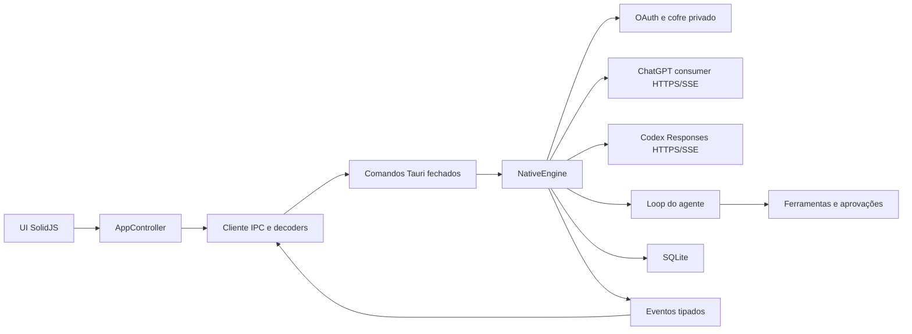

# Arquitetura

## Composição

Não existe processo intermediário, JSON-RPC genérico, seleção dinâmica de
backend ou dependência do Codex CLI. `EngineManager` possui exatamente uma
instância de `NativeEngine` durante a vida do aplicativo.

## Backend

`src-tauri/src/engine/contracts.rs` contém o domínio serializado. Os comandos em
`commands.rs` usam requests com `deny_unknown_fields`, validam tamanho e
semântica e chamam uma operação específica do engine.

O engine nativo divide ownership assim:

- `auth/`: fluxo OAuth, callback, tokens e envelope criptografado privado;
- `chat/`: catálogo consumer, Sentinel, prepare/conduit, deltas `v1` e stream de
  conversa do ChatGPT;
- `provider/`: catálogo Codex, Responses, cookies restritos e stream do agente;
- `agent.rs`: composição das instruções, rodadas e ciclo das ferramentas;
- `tools.rs`: schemas fechados, confinamento de paths, limites e processos;
- `approval.rs`: solicitações de uso único, timeout e cancelamento;
- `storage.rs`: schema SQLite próprio, transações e configuração versionada;
- `mod.rs`: ciclo de vida e ownership dos turnos em execução.

Um turno só se torna ativo após persistência e aquisição exclusiva do
`thread_id`. Falha ao publicar seus eventos iniciais executa rollback antes de a
operação retornar. Conclusão e interrupção removem o mesmo registro de ownership.
Excluir uma tarefa ativa registra a intenção nesse mesmo ownership, cancela o
turno e mantém a tarefa reservada até o storage finalizar e excluir os dados. A
interface nunca encadeia `interrupt` e `delete`, portanto não existe janela entre
as duas operações nem dependência do snapshot visual da tarefa.
No encerramento, novas operações são rejeitadas, aprovações são canceladas,
processos recebem cancelamento e as tasks possuem prazo de drenagem de dez
segundos.

## Frontend

O frontend possui quatro camadas:

1. `contracts/types.ts` define uniões discriminadas imutáveis;
2. `contracts/decode.ts` aceita `unknown` e rejeita campos, variantes, pares e
   relações semânticas inválidas;
3. `infrastructure/codexClient.ts` é a única camada que usa `invoke` e `listen`;
4. `state` e `ui` consomem somente valores já decodificados.

`createAppController` é o dono explícito do estado da sessão. Cada tarefa ativa
possui um runtime isolado em `threadRuntime.ts`; eventos são roteados por
`threadId`, e uma tarefa em segundo plano não altera a conversa visível. A
timeline agrupa itens pelos turnos persistidos, preserva falhas e timestamps e
mantém o scroll medido acima do compositor sobreposto. Configurações usam uma
fila otimista e modelo, esforço e tier são gravados atomicamente. Login duplicado
é coalescido e qualquer falha de contrato entra nos diagnósticos e no alerta
visível.

O fluxo de produto possui duas camadas independentes: `ChatGPT | Codex` e,
dentro do ChatGPT, `Chat | Work`. A troca salva o destino atual antes de
restaurar a última conversa e o último projeto do destino escolhido. A lista do
ChatGPT reúne conversas Chat e Work; a lista do Codex contém apenas tarefas
Codex. Abrir uma conversa Chat ou Work também sincroniza o seletor interno.

## Dados e segredos

- SQLite: `native-state-unified-v1.sqlite3` no diretório de dados do aplicativo;
- sessão: `credentials/chatgpt-oauth.age` no mesmo domínio privado;
- identidade estável do cliente consumer: `chatgpt-consumer-device-id` no diretório
  de dados do aplicativo; contém somente um UUID aleatório, nunca tokens;
- chave do envelope: serviço `codex-desktop-next`, conta
  `chatgpt-oauth-v1`, no Windows Credential Manager;
- projetos conhecidos: schema local `codex-desktop.projects.v1` no WebView;
- tarefas fixadas: schema local `codex-desktop.pins.v1` no WebView.
- produto, modo e últimos destinos: schema local
  `codex-desktop.product-flow.v1` no WebView.
- preferência explícita de modelo/raciocínio do Chat:
  `chatgpt-last-selected-model-v1` no WebView; a chave não existe enquanto o
  usuário usa o padrão dinâmico do catálogo.
- continuidade consumer do Chat: `conversation_id` e `parent_message_id` na
  tabela SQLite `chat_conversations`; tokens de integridade e conduit não são
  persistidos.

Não há leitura de `CODEX_HOME`, `auth.json`, `global/CODEX_AUTH`, banco da CLI ou
outro formato anterior. O aplicativo não possui caminho de migração.

## Falhas e limites

Erros atravessam o IPC como `{ code, message, retryable }`. O provider limita
corpos HTTP e SSE, possui deadline total e de inatividade e só repete falhas
transientes dentro do orçamento declarado. Arquivos e comandos possuem limites
independentes; paths são canonicalizados e symlinks não podem escapar do
workspace. Estados desconhecidos nunca viram fallback visual genérico.

O SQLite limita cada payload e o total de itens/histórico materializado. O
frontend limita diagnósticos, aprovações, projetos e anexos. Quando um limite é
atingido, a operação falha com motivo explícito.

O histórico do provider é normalizado antes da rede. Resultados abortados são
inseridos para chamadas interrompidas e resultados sem chamada são removidos;
a forma reparada substitui o histórico atomicamente e gera um diagnóstico
visível. Assim, uma interrupção ou encerramento no meio de um lote de ferramentas
não pode invalidar os turnos seguintes.
