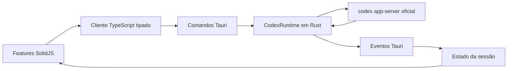

# Arquitetura

## Visão geral

A arquitetura possui uma única integração externa: o protocolo do
`codex app-server`. O frontend não conhece processos, credenciais ou detalhes de
transporte. O runtime Rust não conhece componentes visuais. Essa separação permite
evoluir cada camada sem criar dependências circulares.

## Fronteiras dos módulos

### Interface

`src/features` é organizado por capacidade:

- `auth`: entrada e saída da conta;
- `chat`: timeline, compositor, anexos e seleção de modelo;
- `approvals`: decisões explícitas para solicitações do agente;
- `settings`: preferências, conta, runtime e configuração avançada;
- `session`: dono único do estado e tradutor de notificações do protocolo;
- `shell`: navegação, painel de ambiente e composição visual.

`src/shared/codex` contém somente contratos JSON, helpers de modelo e o cliente
IPC. Componentes compartilhados sem regra de negócio ficam em
`src/shared/components`.

### Ponte Tauri

`src-tauri/src/commands.rs` expõe comandos pequenos e nomeados. Cada comando:

1. recebe uma estrutura tipada;
2. valida o que pertence ao aplicativo;
3. converte para um método oficial do protocolo;
4. devolve erro estruturado à interface.

Não há um comando genérico que permita à UI enviar RPC arbitrário. Isso mantém a
superfície nativa auditável.

### Runtime Rust

`src-tauri/src/codex/runtime.rs` é o único dono do processo filho. Ele resolve o
binário, inicia `codex app-server --listen stdio://`, executa o handshake,
serializa JSONL e correlaciona respostas com `oneshot` por identificador.

Responsabilidades auxiliares ficam isoladas:

- `codex/protocol.rs`: tipos de eventos e estado do runtime;
- `attachments.rs`: inspeção de arquivos e persistência de imagens coladas;
- `error.rs`: catálogo serializável de falhas;
- `lib.rs`: composição Tauri e ciclo de vida.

O processo usa I/O assíncrono, timeout limitado por requisição, encerramento no
drop e uma única trava de inicialização. O executável auxiliar não abre console no
Windows.

## Fluxos principais

### Inicialização

1. A UI invoca `codex_runtime_start`.
2. O runtime inicia o processo e envia `initialize`.
3. Depois da resposta, envia `initialized`.
4. Conta, configuração e modelos são carregados em paralelo.
5. Notificações e solicitações do servidor chegam por eventos Tauri distintos.

### Login

O comando `account/login/start` usa `type: "chatgpt"`. O URL oficial é aberto no
navegador e o `app-server` administra persistência e renovação. O app observa
`account/login/completed` e então atualiza a conta. Nenhum token cru atravessa o IPC.

### Mensagem e anexos

Arquivos comuns se tornam entradas `mention`; imagens validadas se tornam
`localImage`; o texto se torna `text`. Imagens coladas são decodificadas no Rust,
validadas por assinatura e gravadas no cache do aplicativo antes do envio.

### Aprovações

Mensagens RPC com `method` e `id` são tratadas como solicitações do servidor. A UI
mostra uma decisão explícita e responde com o mesmo identificador. Métodos ainda
não suportados nunca recebem aprovação automática.

### Configuração

Leitura e escrita usam `config/read`, `config/value/write` e
`config/batchWrite`. A escrita em lote redefine modelo, esforço e velocidade em
uma única operação. O Codex continua sendo a autoridade sobre camadas, esquema e
persistência do `config.toml`.

O seletor do compositor expõe combinações semânticas, sem apresentar duas
configurações técnicas como se fossem independentes. `Aprovar por mim` grava
`workspace-write` com `on-request`; `Acesso completo` grava
`danger-full-access` com `never`; qualquer outra combinação aparece como
`Personalizado (config.toml)`. Cada preset é aplicado por um único
`config/batchWrite`, evitando estado intermediário incoerente.

### Sistema visual

O shell, o compositor, os menus em cascata e a página inteira de configurações
são componentes independentes. A paleta observada na referência é expressa por
tokens CSS; nenhuma configuração de DPI, zoom ou escala do Windows é alterada.
Submenus recebem dados do protocolo e nunca mantêm uma lista paralela de modelos.

## Regra de evolução

Uma nova capacidade de protocolo deve acrescentar, nesta ordem:

1. contrato em `shared/codex/types.ts` ou `codex/protocol.rs`;
2. comando nativo explícito quando houver chamada iniciada pela UI;
3. transição no dono de estado em `features/session`;
4. feature visual independente;
5. validação live ou teste focado na fronteira alterada.

Não se cria um segundo runtime, um segundo armazenamento de sessão ou uma camada
genérica de serviços. O objetivo é modularidade por ownership, não por quantidade
de arquivos.
