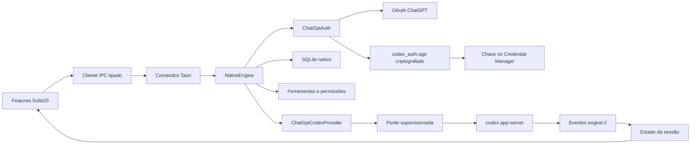

# Arquitetura

## Visão geral

A interface não conhece processos, credenciais, SQLite ou JSON-RPC. O
`NativeEngine` possui as responsabilidades próprias; somente capacidades ainda
não substituídas seguem para a ponte.

## Backend Rust

### Contrato

`src-tauri/src/engine/contracts.rs` define operações fechadas. A UI não consegue
enviar RPC arbitrário. `AgentEngine` expõe iniciar, executar, responder e
encerrar; `EngineManager` escolhe o backend uma vez.

### Módulos nativos

`src-tauri/src/engine/native` é dividido por ownership:

- `auth/`: OAuth, PKCE, callback, tokens e armazenamento seguro;
- `provider.rs`: fronteira das operações de modelo;
- `tools.rs`: catálogo e risco das ferramentas;
- `sandbox.rs`: políticas semânticas de permissão;
- `storage.rs`: metadados versionados em SQLite;
- `mod.rs`: composição, roteamento e ciclo de vida.

### Ponte de compatibilidade

`engine/compatibility.rs` traduz operações não nativas. `codex/runtime.rs` é o
único dono do processo filho, do handshake JSONL, dos timeouts e da correlação de
respostas. A inicialização do `NativeEngine` apenas verifica se o executável está
disponível; o processo nasce na primeira operação compatível. Em uma sessão
autenticada, essa primeira operação é o aquecimento assíncrono solicitado pela
UI para configuração e modelos.

No Windows, o filho não abre console. O logout nativo encerra a ponte antes de
revogar e apagar a credencial, impedindo que uma sessão já carregada continue em
memória.

## Frontend

`src/features` é organizado por capacidade: autenticação, chat, aprovações,
configurações, projetos, sessão e shell. `createCodexSession` compõe os donos de
estado; `createProjectWorkspace` controla a seleção persistida e
`createThreadLibrary` controla paginação, deduplicação e atualização da biblioteca
de tarefas. Assim que a conta autenticada é conhecida, o shell aparece e modelos,
configuração, requisitos administrativos, prontidão do sandbox e tarefas são
carregados em segundo plano. Uma falha fica explícita e a próxima solicitação
pode tentar novamente.

A preferência de projetos contém somente caminhos locais e é versionada no
perfil do WebView. Conversas continuam pertencendo ao armazenamento do Codex;
abrir uma tarefa usa `thread/resume` e reidrata a linha do tempo retornada pelo
contrato oficial, sem duplicar o conteúdo no frontend.

### Linha do tempo

A linha do tempo possui fronteiras pequenas e tipadas:

- `parseTimelineItem` despacha exaustivamente a união oficial `ThreadItem`;
- `parseUserMessage`, `parseToolItem` e `parseSpecialTimelineItem` validam suas
  fronteiras e produzem uniões discriminadas menores;
- `createTimeline` possui hidratação, deltas e substituição de itens por `id`;
- `timelineGrouping` compõe mensagens, raciocínio e ações em blocos semânticos;
- `ActivityGroup`, `ConversationEntry` e `DiffView` apenas renderizam o domínio;
- `createTurnProgress` reduz snapshots de plano e diff a um resumo numérico.

Raciocínio ativo e resumo de ações concluídas são cabeçalhos distintos no tipo,
portanto ícone, cor e semântica não dependem de heurística CSS. Comandos e
resultados de ferramentas possuem limites de memória explícitos e exibem toda
omissão. O diff agregado do turno é processado em uma passagem e descartado; um
diff por arquivo materializa inicialmente no máximo 400 linhas e só cria o
restante após ação do usuário.

O decoder cobre mensagens, hooks, raciocínio, plano, comandos, alterações,
MCP, ferramentas dinâmicas, colaboração, subagentes, busca, espera, revisão,
compactação, visualização e geração de imagens. Tipos ou campos obrigatórios
desconhecidos geram diagnóstico visível; não são convertidos em atividades
genéricas. O progresso incremental de MCP é limitado e preservado até o item
final autoritativo.

Miniaturas são carregadas sob demanda por `IntersectionObserver`. O Rust valida
arquivo regular, tamanho e assinatura PNG, JPEG, GIF ou WebP antes de devolver
um buffer binário. O componente cria e revoga a `Blob URL`, deixando falhas
visíveis sem manter base64 na árvore reativa. Geração de imagem conserva apenas
metadados e `savedPath`; o payload base64 do protocolo é descartado na fronteira.

### Solicitações interativas

`src/features/approvals` é uma fronteira de protocolo própria, não um modal
genérico. `parseServerRequest` mantém um catálogo fechado das solicitações do
app-server e as converte em uma união discriminada. Parsers menores validam
aprovações, perguntas, perfis de permissão e esquemas MCP antes que qualquer dado
chegue aos componentes.

`createServerRequestQueue` é o único dono da fila. Identificadores JSON-RPC
numéricos e textuais permanecem distintos, uma atualização do mesmo `id`
substitui a entrada e `serverRequest/resolved` remove a solicitação de forma
idempotente. Erros de decodificação ficam visíveis como incompatibilidade; nunca
viram aprovação automática.

Cada contrato possui um renderer inline próximo ao compositor:

- comando e arquivo exibem contexto, decisões permitidas e diff autoritativo;
- `request_user_input` preserva opções, texto livre, segredo e resolução
  automática;
- `request_permissions` concede somente o subconjunto marcado, com escopo de
  turno ou sessão e revisão estrita limitada ao turno;
- MCP separa formulário tipado, autorização por URL e formulário opaco não
  suportado, que só pode ser cancelado com segurança.

O handshake da ponte declara `experimentalApi`, `requestAttestation` e
`mcpServerOpenaiFormElicitation` como falsos. Assim, o cliente não anuncia
ferramentas dinâmicas, atestados ou formulários opacos que ainda não implementa.

### Configurações

`src/features/settings` separa navegação, controles reutilizáveis e uma página
por capacidade. `SettingsDrawer` apenas coordena a página ativa, o estado de
salvamento e erros; regras de política e preferências visuais vivem em módulos
sem dependência do renderer.

Configuração do agente usa somente `config/read`, `config/value/write`,
`config/batchWrite` e `configRequirements/read`. As listas permitidas limitam
as opções de aprovação, sandbox e busca; as origens de configuração bloqueiam
valores administrados por sistema, MDM ou empresa. Os defaults administrados de
modelo para novas tarefas continuam sendo defaults: uma seleção explícita não é
tratada como proibida. Toda escrita envia a versão da camada de usuário lida por
último, portanto uma edição externa gera conflito visível em vez de ser perdida.
`windowsSandbox/readiness` completa esse contexto com um diagnóstico fechado e
somente leitura. A UI não inicia instalação, elevação ou alteração do sistema.

Preferências próprias da interface são persistidas no namespace fechado
`desktop.codexDesktopNext`. Tamanho base, movimento, cursor e marcadores de diff
são decodificados em uma união tipada antes de alterar atributos do elemento
raiz. Todo tamanho tipográfico deriva de `rem`; o aplicativo não modifica DPI,
zoom do WebView ou escala do Windows. A página avançada aceita um caminho e um
valor JSON validados, mas deliberadamente não renderiza o objeto efetivo, que
pode conter segredos de integrações.

## Fluxos principais

### Inicialização

1. A UI assina `engine://*` e invoca `engine_start`.
2. O engine valida ferramentas, inicializa SQLite e autenticação nativa.
3. A disponibilidade da ponte é diagnosticada sem iniciar processo.
4. A conta é lida do cofre criptografado com a chave do Credential Manager.
5. A UI mostra login ou shell sem aguardar a ponte.
6. Com sessão válida, configuração, requisitos, prontidão do sandbox, modelos e
   a primeira página de tarefas são solicitados em paralelo; cada dono expõe
   estado explícito de carregamento.

Sem sessão, a ponte permanece inativa. O aquecimento não usa temporizador,
polling ou cache persistente paralelo: concorrência é deduplicada no dono da
sessão e no runtime Rust.

### Login ChatGPT

1. `engine_login_chatgpt` cria listener, estado e PKCE.
2. A UI abre a URL retornada no navegador.
3. O backend valida o callback e troca o código.
4. A credencial é persistida no cofre age e somente sua chave entra no keyring.
5. Eventos públicos atualizam a tela.

Falha ao abrir o navegador cancela o fluxo. Um logout concorrente cancela o
login, aguarda a seção crítica e garante a remoção final. Revogação remota falha
visivelmente, mas nunca impede a exclusão local.

### Mensagem e anexos

Arquivos comuns viram `mention`, imagens validadas viram `localImage` e texto
vira `text`. Imagens coladas são decodificadas, verificadas por assinatura e
gravadas no cache antes do envio. Imagens históricas usam a mesma validação para
pré-visualização binária. O histórico distingue ainda imagem e áudio remotos,
áudio local, skills e menções sem iniciar downloads externos automaticamente.
A primeira tarefa inicia a ponte compatível.

### Configuração e permissões

Leitura, requisitos e escrita usam operações dedicadas. A UI filtra opções pelas
restrições administrativas e desabilita chaves cuja origem é gerenciada. Presets
de permissão são aplicados em lote:

- **Somente leitura**: `read-only` + `untrusted`;
- **Aprovar por mim**: `workspace-write` + `on-request`;
- **Acesso completo**: `danger-full-access` + `never`;
- qualquer outra combinação: **Personalizado**.

## Regra de evolução

Uma capacidade nova segue contrato de domínio, implementação nativa ou adaptador
isolado, comando Tauri, transição no dono de estado, componente visual e
validação ao vivo. Não se cria RPC genérico, armazenamento paralelo de
credenciais nem fallback silencioso.
