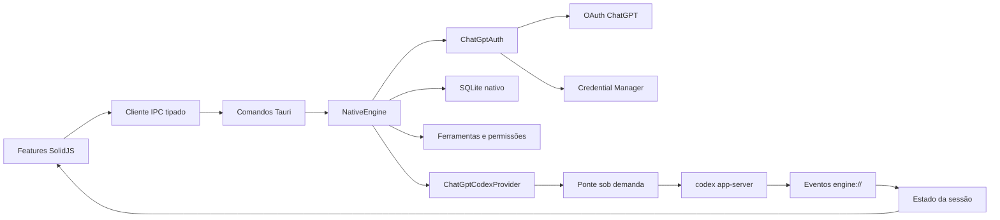

# Arquitetura

## Visão geral

A interface não conhece processos, credenciais, SQLite ou JSON-RPC. O
`NativeEngine` possui as responsabilidades próprias; somente capacidades ainda
não substituídas seguem para a ponte.

## Backend Rust

### Contrato

`src-tauri/src/engine/contracts.rs` define operações fechadas. A UI não consegue
enviar RPC arbitrário. `AgentEngine` expõe iniciar, executar, responder e
encerrar; `EngineManager` escolhe o backend uma vez.

### Módulos nativos

`src-tauri/src/engine/native` é dividido por ownership:

- `auth/`: OAuth, PKCE, callback, tokens e armazenamento seguro;
- `provider.rs`: fronteira das operações de modelo;
- `tools.rs`: catálogo e risco das ferramentas;
- `sandbox.rs`: políticas semânticas de permissão;
- `storage.rs`: metadados versionados em SQLite;
- `mod.rs`: composição, roteamento e ciclo de vida.

### Ponte de compatibilidade

`engine/compatibility.rs` traduz operações não nativas. `codex/runtime.rs` é o
único dono do processo filho, do handshake JSONL, dos timeouts e da correlação de
respostas. A inicialização do `NativeEngine` apenas verifica se o executável está
disponível; o processo nasce na primeira operação compatível.

No Windows, o filho não abre console. O logout nativo encerra a ponte antes de
revogar e apagar a credencial, impedindo que uma sessão já carregada continue em
memória.

## Frontend

`src/features` é organizado por capacidade: autenticação, chat, aprovações,
configurações, sessão e shell. `createCodexSession` é o único dono das transições
de estado e impede que bootstrap, login ou seleção de workspace iniciem a ponte.
Modelos e configuração são carregados apenas quando o usuário abre um controle
que depende deles ou inicia uma tarefa.

## Fluxos principais

### Inicialização

1. A UI assina `engine://*` e invoca `engine_start`.
2. O engine valida ferramentas, inicializa SQLite e autenticação nativa.
3. A disponibilidade da ponte é diagnosticada sem iniciar processo.
4. A conta é lida diretamente do Credential Manager.
5. A UI mostra login ou shell; modelos e configuração permanecem ociosos.

### Login ChatGPT

1. `engine_login_chatgpt` cria listener, estado e PKCE.
2. A UI abre a URL retornada no navegador.
3. O backend valida o callback e troca o código.
4. A credencial é persistida diretamente no keyring.
5. Eventos públicos atualizam a tela.

Falha ao abrir o navegador cancela o fluxo. Um logout concorrente cancela o
login, aguarda a seção crítica e garante a remoção final. Revogação remota falha
visivelmente, mas nunca impede a exclusão local.

### Mensagem e anexos

Arquivos comuns viram `mention`, imagens validadas viram `localImage` e texto
vira `text`. Imagens coladas são decodificadas, verificadas por assinatura e
gravadas no cache antes do envio. A primeira tarefa inicia a ponte compatível.

### Configuração e permissões

Leitura e escrita usam operações dedicadas. Presets são aplicados em lote:

- **Somente leitura**: `read-only` + `untrusted`;
- **Aprovar por mim**: `workspace-write` + `on-request`;
- **Acesso completo**: `danger-full-access` + `never`;
- qualquer outra combinação: **Personalizado**.

## Regra de evolução

Uma capacidade nova segue contrato de domínio, implementação nativa ou adaptador
isolado, comando Tauri, transição no dono de estado, componente visual e
validação ao vivo. Não se cria RPC genérico, armazenamento paralelo de
credenciais nem fallback silencioso.
