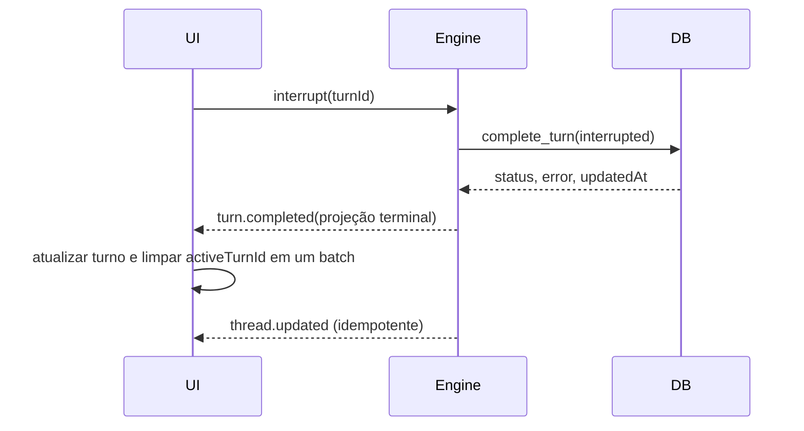

# Estabilidade, edição nativa e revisão no fluxo Codex

## Contexto

O aplicativo já possui um motor Rust nativo, timeline de eventos, ferramentas de
arquivo e uma inspeção básica do repositório. Os defeitos observados não pedem
uma camada de compatibilidade: eles revelam contratos incompletos e uma
projeção visual ainda distante do fluxo do Codex oficial.

Os problemas confirmados são:

- `FileChangeKind::Update` é persistido com `move_path`, enquanto o contrato
  TypeScript aceita apenas `movePath`;
- “Recentes” repete tarefas que já pertencem a projetos configurados;
- `turn.completed` encerra o runtime, mas não conclui imediatamente o turno no
  cache visual, deixando “Trabalhando há …” depois de interromper;
- o modelo conhece ferramentas de leitura, escrita e edição exata, mas não
  dispõe de `apply_patch` com o formato livre usado pelo Codex;
- cada evento de ferramenta vira um cartão independente, com estados de
  sucesso repetidos, em vez de grupos compactos e expansíveis;
- a inspeção Git retorna somente status e caminho, falha acima de 512 entradas
  ou 524.288 bytes e usa um timeout global de dois segundos;
- não existe o resumo “N arquivos alterados +A -D” nem uma revisão navegável de
  diffs acima do compositor.

Esta especificação substitui esses comportamentos diretamente. Não adiciona
aliases permanentes, adapters, rotas antigas, migrações de schema, fallback
silencioso ou dependência do CLI/app-server.

O usuário autorizou explicitamente a execução autônoma do desenho consolidado
em 4 de agosto de 2026.

## Objetivos

- Tornar Rust, SQLite, eventos e TypeScript um contrato canônico único.
- Fazer conclusão, falha e interrupção aparecerem de forma determinística no
  mesmo evento que encerra o runtime.
- Mostrar tarefas de projeto somente dentro do projeto e reservar “Recentes” a
  tarefas sem projeto configurado.
- Adicionar `apply_patch` nativo, livre, validado e transacional.
- Preservar o log bruto de eventos e derivar dele uma timeline compacta no
  frontend, sem perder detalhes técnicos.
- Expor resumo Git imediato e revisão completa, carregada sob demanda, sem
  limites globais artificiais para projetos grandes.
- Remover controles sem efeito e manter erros reais visíveis e acionáveis.

## Não objetivos

- Aceitar `move_path` indefinidamente ou afrouxar os decoders TypeScript.
- Repetir silenciosamente ferramentas ou turnos interrompidos.
- Transformar eventos de apresentação em novo estado persistido.
- Executar patches por shell, PowerShell ou utilitário lateral.
- Carregar o diff inteiro de todo o repositório na abertura da tarefa.
- Adicionar staging, descarte, commit ou edição no painel de revisão antes de
  existir um contrato nativo completo para essas ações.
- Integrar ripgrep ou recuperação Serena/Semble neste incremento; eles serão o
  próximo desenho, depois desta base estar verificada.

## Alternativas avaliadas

### Retoque somente com CSS

Reduziria cartões e selos, mas não conseguiria agrupar eventos, concluir um
turno parado, produzir estatísticas Git nem oferecer diffs navegáveis. Foi
rejeitado porque esconderia sintomas sem corrigir estado ou arquitetura.

### Agregar timeline e diffs completos no backend

O backend poderia persistir grupos já prontos e devolver um patch monolítico.
Isso misturaria apresentação com domínio, perderia a ordem original e faria a
latência e a memória crescerem com o tamanho do projeto. Foi rejeitado.

### Eventos canônicos + projeção pura + revisão nativa incremental

Opção selecionada. O Rust emite e persiste fatos canônicos. O frontend projeta
grupos visuais de forma pura e reversível. A revisão lê primeiro metadados
baratos e busca o conteúdo de cada arquivo em páginas somente quando ele fica
visível ou é expandido. Essa divisão mantém fidelidade, baixa latência e
diagnósticos completos.

## 1. Contrato canônico de alterações de arquivo

`FileChangeKind` continuará sendo uma enum internamente tipada, mas os campos de
variantes usarão camelCase no wire. O contrato único será:

```json
{
  "type": "update",
  "movePath": null
}
```

O serializer Rust deve aplicar a renomeação também aos campos das variantes.
O decoder TypeScript continuará estrito e não aceitará `move_path`.

Como já existem registros locais escritos pelo serializer defeituoso, a
implementação fará uma manutenção única no banco desta instalação:

1. localizar e validar o arquivo SQLite exato usado pelo app;
2. parar o processo que mantém o banco aberto, se necessário;
3. criar uma cópia de segurança com timestamp no mesmo diretório;
4. reescrever somente chaves `kind.move_path` existentes para
   `kind.movePath`, dentro de uma transação;
5. reler todas as threads afetadas com o decoder canônico;
6. não embarcar a rotina de manutenção no aplicativo.

Falha na validação restaura o arquivo original. Essa manutenção de dados do
ambiente não cria retrocompatibilidade no produto.

## 2. Conclusão determinística de turno

`turn.completed` passará a carregar uma projeção terminal suficiente para
atualizar a UI sem aguardar `thread.updated`:

```text
threadId
turn.id
turn.status
turn.error
turn.updatedAt
```

O storage continua concluindo o turno antes da emissão. O evento usa os valores
retornados pela mesma transação, não `Date.now()` do frontend.

Ao receber o evento, o controller executa um único batch:

- substitui status, erro e `updatedAt` do turno correspondente;
- limpa `activeTurnId` somente se ele corresponde ao turno concluído;
- remove aprovações pendentes desse turno;
- preserva todos os itens já recebidos;
- recalcula o estado visível da thread.

Um `thread.updated` posterior é idempotente. Eventos terminais duplicados com o
mesmo conteúdo não alteram estado; conteúdo terminal conflitante é erro de
contrato visível. Interromper nunca inventa sucesso: o status final permanece
`interrupted`.

## 3. Projetos e Recentes

Os caminhos continuam sendo comparados pelo helper canônico `pathsEqual`. A
projeção da barra lateral será:

```text
Projetos = cada projeto configurado + tarefas cujo cwd pertence a ele
Recentes = tarefas cujo cwd não pertence a nenhum projeto configurado
```

A busca aplica o mesmo particionamento antes do filtro textual, portanto uma
tarefa nunca aparece nas duas seções. Remover um projeto move naturalmente suas
tarefas para “Recentes”; adicionar o projeto faz o inverso, sem persistir uma
segunda classificação.

## 4. `apply_patch` nativo

### Contrato do modelo

`apply_patch` será uma ferramenta custom/freeform, não uma função JSON. A
entrada aceita exatamente um envelope:

```text
*** Begin Patch
*** Add File: path
...
*** Update File: path
...
*** Move to: new-path
*** Delete File: path
*** End Patch
```

A gramática, mensagens de erro e resolução de hunks seguirão o comportamento
moderno do Codex de referência, adaptados aos tipos do `NativeEngine`. Não será
copiado um crate inteiro nem criado processo lateral.

### Fases transacionais

1. Parsear todo o documento com posições de erro precisas.
2. Normalizar caminhos relativos ao workspace e rejeitar absolutos, `..`,
   diretórios, destinos repetidos e escapes por symlink.
3. Ler todos os arquivos de entrada e validar todos os hunks em memória.
4. Construir o conjunto final de bytes e a lista canônica de `FileChange`.
5. Revalidar que as fontes não mudaram desde a leitura.
6. Gravar arquivos temporários no mesmo volume e aplicar renomes atômicos.
7. Em qualquer falha, restaurar os arquivos já trocados e remover temporários.
8. Persistir e emitir um único item `fileChange` concluído somente depois do
   commit de filesystem.

Cancelamento é observado antes da validação, antes do primeiro write e entre as
trocas. Read-only falha antes de ler conteúdo desnecessário. Nenhum caminho
alternativo tenta PowerShell, `git apply`, `patch.exe` ou substituição textual
silenciosa.

## 5. Projeção visual da timeline

### Estado bruto preservado

`ThreadItem[]` continua sendo a fonte durável e ordenada. Um módulo puro cria
uma união visual:

```text
UserMessage
WorkGroup
AgentMessage
ContextCompactionRow
```

`WorkGroup` reúne apenas atividades contíguas do mesmo turno. Mensagens do
usuário, respostas finais e compactações são fronteiras explícitas. Nenhuma
informação é descartada: expandir um grupo reconstrói os filhos originais.

### Resumos

O título é derivado do conteúdo:

- somente comandos: “Executou um comando” / “Executou N comandos”;
- somente arquivos: “Editou um arquivo” / “Editou N arquivos”;
- arquivos e comandos: “Editou arquivos e executou comandos”;
- ferramentas heterogêneas: resumo curto pelas categorias presentes;
- turno concluído recolhido: “Trabalhou por 18m 58s”.

O grupo ativo fica aberto e mostra a ação corrente. Grupos concluídos ficam
recolhidos por padrão. Falhas abrem automaticamente e mantêm comando, saída,
erro e status técnico disponíveis. Os selos verdes repetidos de “Concluído” são
removidos; sucesso é o estado visual neutro, enquanto falha e cancelamento têm
contraste explícito.

### Linhas detalhadas

- comando: `Comando executado: <resumo>` com saída expansível;
- edição: caminho, `+A -D` e diff expansível;
- leitura/busca: ícone, descrição curta e alvo;
- raciocínio: texto discreto durante atividade, sem cartão de sucesso;
- compactação: linha simples “Contexto compactado automaticamente”;
- resposta final: conteúdo plano, fora dos cartões de trabalho;
- mensagem do usuário: bolha alinhada à direita, como no Codex oficial.

Todos os toggles usam botão real, foco visível, `aria-expanded` e navegação por
teclado. Preferência de movimento reduzido continua respeitada.

## 6. Resumo de alterações e painel Revisão

### Contratos nativos

A inspeção atual será substituída por três operações explícitas:

```text
workspace_review_start(cwd) -> ReviewSummary + first ChangePage
workspace_review_changes_page(reviewId, cursor) -> ChangePage
workspace_review_diff_page(reviewId, path, cursor) -> DiffPage
```

`ReviewSummary` contém identidade do repositório, quantidade total de arquivos,
adições, remoções e um `reviewId` efêmero. Cada mudança usa status tipado,
caminho atual, caminho anterior opcional, estatísticas opcionais para binários e
conflitos, e flags staged/unstaged.

Não haverá máximo global de 512 arquivos, 524 KiB ou dois segundos. Git será
iniciado com argumentos explícitos, stdin nulo, kill-on-drop e cancelamento.
Status e `numstat` serão consumidos como streams. Páginas limitam somente o
tamanho de cada resposta IPC; o cursor permite chegar ao último arquivo e à
última linha.

O patch de cada arquivo será gerado somente quando solicitado. Saída grande é
gravada em cache temporário associado ao `reviewId` e lida por offsets em
fronteiras UTF-8/linha. Trocar de workspace, atualizar a revisão ou fechar o app
cancela processos e remove o cache efêmero. Um resultado de geração anterior
nunca substitui um review mais novo.

Arquivos não rastreados, binários, renomes, deleções, conflitos, repositório sem
commit inicial e HEAD destacado têm estados explícitos. Um diff que muda durante
a leitura é marcado desatualizado e solicita atualização; não é combinado com
metadados antigos.

### Chip acima do compositor

Quando houver mudanças, a dock mostra um botão compacto:

```text
3 arquivos alterados  +202  -10
```

O valor vem do `ReviewSummary`, nunca dos eventos da conversa. Assim ele inclui
edições externas, anteriores e produzidas por qualquer ferramenta. Clicar abre
o painel na aba “Revisão”. Estado limpo remove o chip; carregamento preserva o
último resumo com indicador discreto, sem piscar para zero.

O controller atualiza o resumo:

- ao selecionar ou abrir uma tarefa;
- depois de qualquer `fileChange` terminal;
- ao abrir o painel;
- por ação explícita de atualizar;
- quando a janela recupera foco após mudanças externas.

Pedidos são protegidos por sequência e cancelamento para evitar race entre
workspaces.

### Painel dividido

O painel existente passa a ter abas “Revisão” e “Ambiente”. “Ambiente” conserva
largura compacta. “Revisão” usa aproximadamente metade da área útil, com mínimo
legível e modo overlay em janelas estreitas. A lista apresenta arquivos em
seções empilhadas; seções visíveis carregam hunks sob demanda e oferecem
paginação contínua até o fim.

Cada cabeçalho mostra status, caminho e `+A -D`. Linhas adicionadas, removidas e
contexto usam cores sem depender apenas de cor, números de linha separados e
seleção/cópia de texto. Binários e conflitos mostram uma explicação real, não
um diff inventado.

Controles de commit, stage, undo ou edição não serão exibidos neste incremento,
pois seriam inertes. Fechar e atualizar são ações completas desde a primeira
versão.

## Fluxos principais

### Parada do turno



### Revisão incremental


## Erros e observabilidade

- Erros de contrato mantêm caminho JSON exato, mas mensagens técnicas longas
  são apresentadas em detalhe expansível, com resumo humano no toast.
- Erro de uma revisão não apaga o último resumo válido; a aba mostra a falha e
  permite atualizar.
- Falha de `apply_patch` não produz item concluído nem filesystem parcial.
- Falha de rollback é um erro de integridade de alta prioridade e inclui os
  caminhos que exigem intervenção manual.
- Processos Git cancelados por troca de workspace não geram toast.
- Nenhum erro é convertido em sucesso visual.

## Testes

### Contratos e estado

- Rust serializa `movePath`; TypeScript aceita o formato e rejeita
  `move_path`;
- manutenção única preserva todos os demais bytes lógicos dos payloads;
- `turn.completed` conclui imediatamente status, erro e duração;
- evento terminal duplicado é idempotente e conflito é rejeitado;
- interrupção remove “Trabalhando” sem esperar `thread.updated`;
- “Recentes” exclui todos os caminhos de projetos, inclusive variações Windows.

### `apply_patch`

- add, update, delete e move isolados e combinados;
- múltiplos hunks, contexto ambíguo, CRLF/LF, Unicode e arquivo sem newline;
- caminho absoluto, traversal, symlink escape e destino duplicado rejeitados;
- mudança concorrente entre validação e commit rejeitada;
- falha na segunda troca restaura a primeira;
- cancelamento e read-only não deixam temporários nem mudanças;
- um patch bem-sucedido emite exatamente um `fileChange` canônico.

### Timeline

- projeção mantém ordem e todos os IDs brutos;
- agrupamento respeita mensagens, compactações e turnos;
- singular/plural e combinações de comandos/arquivos;
- grupo ativo aberto, concluído recolhido e falha aberta;
- diff, saída e erro continuam acessíveis por teclado;
- snapshots visuais nos estados vazio, ativo, sucesso, falha e compactação.

### Revisão

- branch, detached, sem HEAD e não-Git;
- tracked, staged, unstaged, untracked, rename, delete, binary e conflito;
- mais de 512 e mais de 10.000 mudanças chegam por páginas até o fim;
- arquivo com diff multi-megabyte chega por páginas sem resposta IPC gigante;
- troca de workspace descarta resposta antiga;
- refresh invalida cache e detecta diff desatualizado;
- chip e soma `+A -D` correspondem ao conteúdo final do workspace;
- abertura, fechamento, overlay estreito e foco por teclado.

### Verificação final

- testes frontend e Rust direcionados;
- `pnpm verify` completo;
- `git diff --check` e auditoria de mudanças não relacionadas;
- execução local do app com envio, interrupção, patch, edição externa e revisão;
- auditoria por `rg` para aliases, caps globais antigos, fallbacks e controles
  inertes.

## Sequência de entrega

1. corrigir contrato `movePath` e reparar o banco local com backup;
2. concluir turno pelo evento terminal e corrigir “Recentes”;
3. implementar e testar `apply_patch` nativo;
4. criar a projeção compacta da timeline;
5. substituir a inspeção Git limitada pelo serviço de revisão incremental;
6. adicionar chip, aba e painel dividido;
7. executar regressão completa e auditoria de limitações;
8. iniciar o desenho separado de ripgrep nativo e recuperação seletiva.
