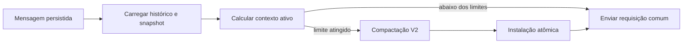

# Compactação dinâmica de contexto

## Contexto

O motor nativo já implementa compactação manual e automática com o protocolo
Responses Remote Compaction V2: envia o histórico seguido de
`compaction_trigger`, exige exatamente um checkpoint `compaction` criptografado
e instala esse checkpoint como novo histórico. O defeito observado não é a
ausência do recurso, mas a política que decide quando executá-lo.

Hoje `agent.rs` compara o limite do modelo apenas com o último
`response.completed` persistido. A nova mensagem do usuário é gravada antes do
turno, mas não entra nesse cálculo. O mesmo vale para mensagens dirigidas ao
turno e saídas de ferramentas adicionadas depois da última resposta do modelo.
Assim, uma requisição pode ultrapassar a janela antes que exista uma nova
medição do servidor e o erro bruto de limite chega à interface.

Esta mudança reproduz o fluxo do Codex de referência estudado no commit
`ee0247f95a6fe2b094ba2253d82cae2a2b4c2dff`, adaptado à arquitetura
`NativeEngine` deste projeto e sem dependência do CLI, app-server, endpoints
alternativos ou estruturas de compatibilidade.

## Objetivos

- Calcular o contexto ativo antes de cada requisição relevante usando a última
  medição compatível do servidor somada aos itens locais ainda não medidos.
- Compactar automaticamente antes da amostragem quando o orçamento automático
  ou a janela útil do modelo tiver sido atingido.
- Preservar o comportamento oficial para um estouro inesperado: o turno falha
  visivelmente, o contexto é marcado como cheio e a próxima submissão compacta
  antes de chamar o modelo.
- Manter a compactação manual e automática no mesmo motor e no mesmo protocolo
  Remote Compaction V2.
- Instalar checkpoint, histórico substituto e marcador de timeline como uma
  única transação persistente.
- Reduzir `agent.rs` por meio de módulos explícitos e testáveis, sem colocar
  política de contexto no frontend.

## Não objetivos

- Repetir silenciosamente no mesmo turno uma requisição comum recusada por
  excesso de contexto.
- Criar um novo endpoint `/responses/compact`, resumidor local ou fallback de
  modelo.
- Criar tabela de ledger de contexto, migração de banco, alias, adapter ou
  caminho de retrocompatibilidade.
- Adicionar um tokenizer ou fingir precisão que o protocolo não oferece; a
  estimativa permanece deliberadamente conservadora e saturante.
- Inventar `comp_hash`, estado de mundo persistido ou metadados que não existem
  no contrato local do catálogo.
- Alterar o contrato TypeScript, os comandos IPC ou os controles visuais já
  existentes.

## Alternativas avaliadas

### Correção mínima dentro de `agent.rs`

Somar o tamanho da mensagem atual ao último uso resolveria o caso mais simples,
mas manteria erros de provider baseados em texto, duplicaria decisões pré e
pós-ferramenta e aumentaria um módulo que já concentra responsabilidades demais.
Foi rejeitada por não produzir uma política única nem uma fronteira testável.

### Ledger persistente de contexto

Uma tabela com snapshots e deltas permitiria consultas diretas, mas duplicaria
informação que já está ordenada em `provider_items` e `thread_items`, exigiria
schema e introduziria mais estados que poderiam divergir. Foi rejeitada porque
o histórico mais o último marcador de uso são suficientes.

### Política nativa modular, selecionada

Um módulo puro calcula a ocupação; outro executa e instala compactações. O loop
do agente apenas decide em quais fronteiras invocá-los. Códigos de erro do
provider são convertidos em variantes de domínio, e a persistência instala o
resultado atomicamente. Esta opção é a menor arquitetura que reproduz as
semânticas oficiais sem criar abstrações genéricas.

## Arquitetura

### `context_window.rs`

Novo módulo interno responsável por:

- estimar tokens visíveis de `ResponseItem`, instruções e definições de
  ferramentas;
- localizar os itens adicionados depois da última saída gerada pelo modelo;
- combinar uma medição compatível do servidor com esse delta local;
- produzir uma decisão explícita de pré-compactação;
- preparar uma cópia do histórico que caiba na requisição de compactação;
- selecionar e truncar as mensagens recentes retidas no checkpoint.

O módulo não acessa banco, rede, Tauri nem emite eventos. As operações são puras
e recebem estruturas já carregadas.

### `compaction.rs`

Novo módulo interno responsável pelo ciclo Remote Compaction V2:

1. verificar cancelamento;
2. carregar e normalizar o histórico;
3. preparar uma cópia limitada para a requisição de compactação;
4. emitir `ContextCompaction` como item iniciado;
5. enviar o histórico, ferramentas e `compaction_trigger`;
6. aceitar apenas um `compaction` e um `response.completed`;
7. construir o histórico retido;
8. instalar histórico e item concluído em uma transação;
9. emitir o item concluído somente depois do commit.

Cancelamento ou erro antes do commit nunca muda o histórico persistente. A
compactação iniciada continua visível durante a operação; uma falha do turno
explica por que ela não foi concluída.

### `agent.rs`

O agente continua proprietário do turno, das ferramentas e dos eventos de
stream. Ele passa a:

- carregar histórico, ferramentas e snapshot de uso antes da primeira
  requisição comum;
- consultar a política e compactar uma vez se necessário;
- repetir a mesma consulta depois da execução de ferramentas ou da chegada de
  uma mensagem dirigida ao turno, antes da continuação comum;
- tratar `ContextWindowExceeded` somente na amostragem comum;
- persistir uma medição cheia e devolver o mesmo erro ao finalizador do turno.

Não haverá loop genérico de retry nem correspondência por substring.

### `storage.rs`

`latest_context_usage` passa a retornar o modelo associado ao uso, além de
`TokenUsage`. Um `ContextCompaction` mais recente continua zerando o snapshot.

Uma operação explícita `install_compacted_history` valida os payloads antes de
abrir a transação e, dentro dela:

- verifica que thread e turno pertencem um ao outro e estão ativos;
- substitui todos os `provider_items` da thread;
- persiste o `ThreadItem::ContextCompaction` concluído no turno;
- confirma as duas alterações juntas.

`replace_provider_history` permanece apenas para a normalização legítima do
histórico antes de requisições. Não é um caminho de compatibilidade.

### Erros de provider

`AppError` ganha `ContextWindowExceeded(String)`, com código público
`contextWindowExceeded` e `retryable: false`.

Os dois limites de protocolo preservam a identidade estruturada:

- resposta HTTP não bem-sucedida: decodifica `error.code` e `error.type` antes
  de formatar a mensagem;
- evento SSE `response.failed`/`error`: lê o mesmo código já existente no wire.

Somente o valor exato `context_length_exceeded` gera a variante. Outros códigos
mantêm `ProviderHttp` ou `Provider`. Mensagens humanas nunca controlam fluxo.

## Contabilidade do contexto ativo

### Snapshot compatível

O snapshot mais recente é compatível quando:

- o último item de estado é `ContextUsage`, não `ContextCompaction`; e
- seu `model` é exatamente o modelo selecionado para a nova requisição.

Com snapshot compatível, o contexto ativo é o maior dos dois valores:

```text
uso total informado pelo servidor
+ estimativa de cada item após o último item gerado pelo modelo

estimativa completa da requisição atual
(instruções + histórico normalizado + ferramentas)
```

No Codex de referência, instruções e estado canônico participam do gerenciador
de contexto versionado. Neste projeto eles são recompostos em campos de cada
requisição. Usar o máximo preserva a medição mais precisa do servidor e também
captura instruções ou ferramentas que cresceram desde a resposta anterior, sem
criar um ledger duplicado.

Itens gerados pelo modelo delimitam o snapshot: mensagem `assistant`,
`Reasoning`, `FunctionCall`, `CustomToolCall`, `WebSearchCall` e `Compaction`.
Itens locais após esse delimitador incluem mensagem `user`,
`FunctionCallOutput` e `CustomToolCallOutput`. A varredura usa a ordem real do
histórico, portanto também cobre steers e múltiplas saídas de ferramentas.

Se não houver delimitador coerente para um snapshot existente, a política não
assume um delta vazio: estima a requisição completa.

### Sem snapshot ou com modelo diferente

Na primeira requisição, depois de uma compactação ou depois da troca de modelo,
a política estima a entrada completa que será enviada:

```text
instruções + histórico normalizado + ferramentas visíveis ao modelo
```

Isso cobre redução de janela ao trocar de modelo sem depender de metadados de
um catálogo anterior. O cálculo usa adição saturante e nunca pode dar overflow.

### Estimador

- Estruturas ordinárias são serializadas como JSON e aproximadas por
  `ceil(bytes / 4)`.
- Payloads `data:image/...;base64,...` não são cobrados pelo tamanho bruto da
  base64; cada imagem usa uma estimativa fixa de 1.024 tokens, consistente com o
  custo já adotado pelo projeto.
- `Reasoning` e `Compaction` com conteúdo criptografado usam a aproximação do
  fluxo oficial para bytes visíveis: `max(encoded_len * 3 / 4 - 650, 0)`, depois
  convertidos por quatro bytes por token.
- Instruções e ferramentas também entram como bytes visíveis aproximados.
- Todos os cálculos são `u64` saturantes; nenhum cast pode reduzir um valor
  grande.

O objetivo não é reproduzir billing, mas impedir que entradas locais invisíveis
ao último usage ultrapassem silenciosamente a janela.

### Decisão

A política retorna `Compact` quando o contexto ativo atinge qualquer limite
disponível:

- `SelectedModel::auto_compact_token_limit()`; ou
- `ModelContextWindow::usable_tokens`.

Quando só um limite está disponível, ele é suficiente. Quando nenhum está
disponível, a compactação automática não é inferida. O limite duro
`ModelContextWindow::tokens` continua sendo usado para preparar uma requisição
de compactação que caiba no provider.

## Fluxos de estado

### Pré-turno normal



### Continuação dentro do turno

Depois de um `response.completed`, o agente persiste a medição, executa as
ferramentas e registra suas saídas. Se o turno precisa continuar, a política é
consultada sobre o histórico atualizado. Uma compactação bem-sucedida continua
o mesmo turno com uma nova requisição comum.

### Estouro inesperado do provider

Se `start_response` ou a leitura SSE da requisição comum devolver
`ContextWindowExceeded`:

1. o agente cria um `ContextUsage` para o modelo atual com
   `total_tokens = context_window.tokens` e os demais campos coerentes;
2. persiste e emite esse item;
3. devolve o erro tipado, deixando o turno terminar como falho;
4. na próxima submissão, o preflight enxerga a janela cheia e compacta antes de
   chamar o modelo.

Se o catálogo não informar a janela do modelo, o erro continua visível sem
inventar uma medição. Esse caso não recebe fallback silencioso.

O mesmo erro ocorrido durante a compactação permanece uma falha de compactação;
ele não dispara repetição da amostragem nem marca uma instalação inexistente.

### Compactação manual

O comando manual cria seu turno exclusivo atual e chama o mesmo
`compaction.rs`. Ele ignora a decisão automática, mas preserva cancelamento,
validação estrita, retenção e instalação atômica.

## Preparação da requisição de compactação

O histórico persistido não é alterado antes do checkpoint. Se a estimativa da
requisição de compactação exceder `context_window.tokens`, uma cópia percorre o
sufixo do histórico da mais nova para a mais antiga:

- somente payloads de `FunctionCallOutput` e `CustomToolCallOutput` podem ser
  substituídos;
- a chamada e a saída continuam pareadas;
- o payload vira `Output exceeded the available model context and was
  truncated`;
- a redução para quando a cópia cabe ou no primeiro item do sufixo que não seja
  uma saída regravável.

Se ainda não couber, o provider pode rejeitar a compactação e o erro permanece
visível. Mensagens do usuário, instruções e checkpoints nunca são descartados
silenciosamente para forçar sucesso.

## Construção do histórico compactado

Após um checkpoint válido:

1. selecionar mensagens reais `user` do prompt que foi compactado;
2. caminhar da mais nova para a mais antiga com orçamento de 64.000 tokens de
   texto;
3. manter imagens sem contar a base64 contra esse orçamento textual;
4. se a mensagem corrente ultrapassar o restante, truncar seu texto para usar
   o orçamento restante em vez de pular para uma mensagem mais antiga;
5. restaurar a ordem cronológica;
6. anexar o único `Compaction` criptografado como último item.

O projeto não persiste instruções/developer context em `provider_items`; elas
são compostas novamente no campo `instructions` de toda requisição. Portanto,
não há uma injeção histórica adicional a copiar do Codex de referência.

## Consistência, concorrência e cancelamento

- O runtime existente mantém posse exclusiva da thread durante o turno; nenhum
  segundo compactador pode instalar estado concorrente.
- A cópia de preparação e todos os cálculos são locais e determinísticos.
- Cancelamento é observado antes da rede e durante o stream.
- A instalação só ocorre depois de `response.completed` e de exatamente um
  checkpoint validado.
- O evento concluído só é emitido depois do commit; persistência continua antes
  de emissão.
- Falha de commit deixa o histórico antigo e nenhum marcador concluído.

## Interface e observabilidade

Não é necessário novo componente visual. A interface existente já apresenta:

- ocupação da janela de contexto;
- ação manual de compactação;
- item “Contexto compactado” na timeline;
- erro estruturado de turno.

Durante um estouro inesperado, a medição cheia atualiza o indicador antes do
erro final. Na próxima mensagem, o item de compactação iniciado/concluído torna
a recuperação observável. O novo código público distingue esse caso de uma
falha genérica do provider sem adicionar lógica de recuperação ao frontend.

## Testes e verificação

### Política pura

- snapshot compatível mais mensagem local cruza o limite;
- crescimento das instruções ou ferramentas cruza o limite mesmo com snapshot
  compatível;
- saída de ferramenta local cruza o limite;
- itens anteriores à última saída do modelo não são contados novamente;
- ausência de snapshot estima instruções, histórico e ferramentas completos;
- troca de modelo ignora o snapshot incompatível;
- qualquer um dos dois limites dispara compactação;
- somas saturam em vez de transbordar;
- imagem inline não cobra o tamanho bruto da base64;
- checkpoint criptografado usa a estimativa específica.

### Retenção e preparação

- mensagens recentes são preferidas;
- uma mensagem recente acima do orçamento é truncada, não descartada;
- imagens sobrevivem ao truncamento textual;
- saídas de ferramenta mais recentes são regravadas até a requisição caber;
- histórico durável original permanece inalterado.

### Provider e erro

- HTTP com `error.code = context_length_exceeded` vira a variante tipada;
- SSE com o mesmo código vira a variante tipada;
- códigos e corpos malformados continuam erros genéricos limitados;
- `ContextWindowExceeded` não é retryable no contrato público.

### Persistência e orquestração

- consulta de uso retorna modelo e zera após um marcador de compactação;
- instalação grava histórico e marcador juntos;
- uma falha de validação não substitui histórico;
- medição cheia torna a próxima decisão de preflight `Compact`;
- cancelamento ou checkpoint inválido não instala estado parcial.

### Comandos finais

- testes Rust direcionados dos módulos alterados;
- verificação completa definida pelo projeto com `pnpm verify`;
- validação ao vivo em uma thread descartável autenticada, quando o ambiente
  local oferecer sessão de provider; se não oferecer, a indisponibilidade será
  registrada explicitamente em vez de simulada como sucesso.

## Documentação afetada

`docs/ENGINE.md` e `docs/REFERENCE.md` serão atualizados para descrever a
contabilidade incremental, o fluxo de estouro na próxima submissão e a
instalação atômica. `docs/TODO.md` só será alterado se restar uma ação concreta e
não será usado como diário da implementação.
